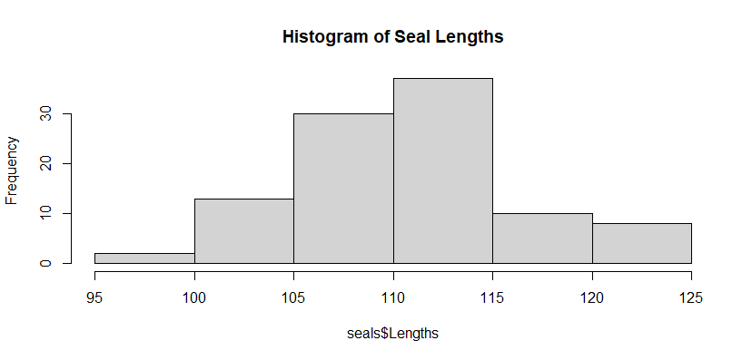
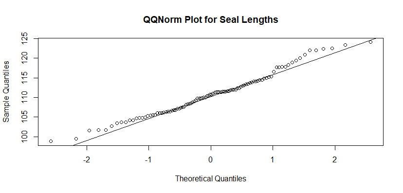

```{r, include=FALSE}
# Allow to include graphics in report.
options(tinytex.verbose = TRUE)
library(knitr)
library(doParallel)
library(parallel)
library(tidyverse)
```
<style>
div.white pre { background-color:white; }
</style>

#### General GitHub repository: [https://github.com/AMLoucas/MT5763_TOWANS](https://github.com/AMLoucas/MT5763_TOWANS)

#### Shiny GitHub repository: [https://github.com/janfor1/MT5763_Shiny](https://github.com/janfor1/MT5763_Shiny)

## Abstract

This project is divided into 4 different sections. For the **Shiny App** section we created a US stock analyser that shows live US stock listings and prices in an interactive fashion. The app uses data from the Finnhub.io API, and allows the user to see changes in the stock over their chosen date range. It also displays information about the stock, recent news, and price targets. In the **Bootstrap** section we set out to create a more efficient version of the "regBoot" procedure in SAS. By making use of the `SURVEYSELECT` procedure and modifying other parts of the code, we were able to make the code significantly faster. For 100 loops, the new program executed in 0.04s as opposed to 2.44s for the old program, and the advantage held across a variety of loop sizes. For the **Jackknife** task our goal was to create efficient code for computing the jackknife estimate of the standard error of the mean of a variable. This was successful, as our macro produced the exact same result as the analytical estimate of the standard error for a dataset of seal lengths, and ran at an average of 0.308s per call. In the **Monte Carlo Simulation** section our goal was to use Monte Carlo simulations to investigate the sample variance of a particular sampling distribution, and consider the effects of a football tournament format. We discovered that the sample variance of the distribution was inversely related to the number of Monte Carlo simulations. For the football tournament we found that the format allowed teams with assumed win probability above 80% to win more than the expected proportion of games, and caused teams with lower expected win probabilities to win fewer than their expected proportion. Parallelisation was successful in reducing the runtime of the Monte Carlo simulations.  

## Introduction

  The overall purpose of this project is to demonstrate the programming skills acquired in SAS and R, while making use of version control through GIT to ensure proper documentation. We worked as a team to complete and produce the deliverables for the following 4 independent tasks.
  
  For the **Shiny App** component, we decided as a group to create a Shiny application using a stock exchange API. The purpose here was to create a user-friendly API that updates each hour, or when the user presses a refresh button. The objectives in this task also included making the app as interactive as possible, and ensuring that the data was easily digestible for the user. 
  
  The purpose of the **Bootstrap** task was to optimise existing SAS bootstrap code from the regBoot.SAS file in order to make it faster. To determine if the task was successful, we had to obtain and visualise 95% confidence intervals, as well as compare the speed of the new code with the original code provided by implementing it for some data on seal lengths.
  
  In the **Jackknife** section, our goal was to code a Jackknife algorithm for computing an estimate of the standard error of the sample mean, and then implement it on the seal length data. To confirm the method was successful, we then needed to compare our estimate with the analytical estimate. A secondary goal was to ensure that the code was efficient enough to run on larger data sets. 

  For the **Monte Carlo Simulation** task, we had to code and implement two Monte Carlo Simulations using R. The purpose of the first simulation (**part A**) was to derive a sampling distribution for the probability that a particular normal random variable was greater than a particular uniform random variable, and investigate how the sample variance of that distribution changed with respect to the number of simulations. The aim of the second simulation (**part B**) was to determine the effect of a football tournament format on the observed win rate of teams relative to their expected win rate. A secondary objective in both tasks was to make use of parallel computation to ensure that the simulations ran efficiently or alternatively, show that parallel computation was not useful in this application.  


## 1 Developing a Shiny App (R)

**Link to Shiny GitHub repository:** https://github.com/janfor1/MT5763_Shiny.git \
**Link to Shiny App:** https://janforschner.shinyapps.io/mt5763_shiny/

For this project, we have developed a **US Stock Analyser** Shiny app. This app gives a live overview of the stock market data for more 8000 publicly listed US companies as well as additional analyst recommendations, organisation details and relevant company news. The app uses data from the free version of the Finnhub.io API (limit of 50 API calls per minute).

### 1.1 Functionality
The US Stock Analyser Shiny app we have created takes relevant user inputs to import API data and display corresponding stock and company data.

The **`server.R`** file is responsible the main functionality of the app and is split into 2 sections. In the first section, `eventReactive` functions are used to access, load and manipulate relevant API data using the `httr::GET()` function, before putting it into appropriate data frames. The reactive functions are designed such that they only re-run the code, if one of the corresponding inputs is modified or the data is refreshed (either using the refresh button or the 1 hour refresh timer). The functions also contain relevant custom error messages that use the `shiny::validate()` function to inform the user in case of invalid inputs or missing data. The second part of the server file contains the different `output` elements including Plotly (candlestick, time-series and analyst) graphs (`renderPlotly` function), HTML output (`renderUI` function) for text displayed in the app, outputs for the value boxes (`renderValueBox` function) and the download button functionality (`downloadHandler` function).

In the **`ui.R`** file, we have included the inputs and UI elements as well as the main body output elements of the app. We have decided to use the dashboard layout (provided by the `shinydashboard` library), as this displays the data in a more effective way and also provides a better design. The sidebar includes relevant user inputs, the refresh and download buttons as well as help text for the data input. The Stock Name field makes use of the `selectizeInput` function to create a text input field with a pre-determined list of compatible stock names. Meanwhile, the stock date range and resolution input controls are set up using the `dateRangeInput` and `selectInput` functions, respectively. Basic CSS tags have been used to format the buttons and text in the sidebar. The main dashboard itself is separated into different rows  using the `fluidRow` function. These contain the value boxes for current stock prices, standard dashboard boxes (using the `box` function) and tab boxes (using the `tabBox` function) to display the different graphs and HTML output.

Finally, we have made use of the **`global.R`** document to make the server code cleaner and more concise. This file is responsible for loading all required packages, as well as defining functions for data wrangling (making use of the `tidyverse` library) and error messages (for the API limit) that are used in the server file. In addition, the document contains the code that loads the list of all compatible stock names used for the Stock Name input text field. 
The app also includes a **`Readme.md`** file as well as a **`DESCRIPTION`** file. The `Readme.md` file provides a brief description and instructions for using the app, while at the same time describing the contents and purpose of the different app files. The `DESCRIPTION` file on the other hand gives app details (such as title, author, etc.) and allows for the app to be launched in Showcase Mode.

### 1.2 Using the Shiny app

The user can interact with the Shiny app in a variety of ways. The available data inputs as well as the outputs shown on the dashboard are explained in detail below.

#### Sidebar

```{r, echo=FALSE, fig.align='center',  out.width="95%", out.height="95%", fig.cap="FIGURE 1.1: Screenshot of the Shiny app showing the sidebar with user inputs, refresh button and download button."}
knitr::include_graphics("Shiny_Screenshots/Navbar.png")
```

The sidebar is located on the left of the app dashboard and includes several data inputs and buttons as explained below. It can also be hidden by pressing the button (3 horizontal white lines) next to the app name.

1. **Stock Name:** Stock name/ticker input field that accepts compatible US letter stock codes (such as AAPL, AMZN, GOOGL, etc.). The field shows suggestions for the 8000+ supported stocks (using the `selectizeInput` function) as the user types and ensures only compatible names are entered.
2. **Search Button:** The search button is a standard `actionButton` and is used to confirm the stock selection in the *Stock Name* field and load the relevant data.
3. **NASDAQ Stock Names:** This button opens a list of NASDAQ listed companies with their respective stock names in a new tab.
4. **Stock Date Range:** The date range selector allows the x-axis (date/time) limits for the candlestick plot and the time-series plot to be selected using the `dateRangeInput` function.
5. **Resolution:** Here the user can select the resolution for the candlestick plot and the time-series plot (i.e. the time intervals for which the financial data is downloaded and shown), ranging from 1 minute to 1 month (uses `selectInput` function). The note below the input field, details the limitations for certain time frames and resolutions.
6. **Refresh Button:** Users can press the refresh button to manually update all stock data and reload the relevant output. In addition, there is a 1 hour refresh timer, that automatically refreshes the data every hour.
7. **Last Updated Info:** The text below the *Refresh Button* indicates the last time that stock data has been updated.
8. **Download Stock Data Button:** Pressing this button will download stock data (time/date, open, close, low, high) as a csv file for the currently selected stock, date range and resolution (uses `downloadButton` function).

There are restrictions on the date range and resolutions that are explained in the sidebar. In particular, resolutions smaller than 1 day are not available for 2019 and earlier and the date range for such graphs is limited to a maximum of 3 months. Also, it should be noted that the resolution must be smaller than the selected date range (i.e. if 1 day of data is selected a resolution of 1 month will return an error) and that the end date must be after the start date. If the input values are invalid or violate these rules, custom error messages will be shown informing the user.

#### Dashboard

The US Stock Analyser dashboard is the section of the app where all relevant data is displayed. The individual outputs are explained here.

```{r, echo=FALSE, fig.align='center',  out.width="95%", out.height="95%", fig.cap="FIGURE 1.2: Screenshot of the top section of the app dashboard showing live stock quotes and stock plots in a tab box."}
knitr::include_graphics("Shiny_Screenshots/DashboardP1.png")
```

1. **Current Price:** Displays the current stock price (at last update time/date) for the selected stock in USD.
2. **Daily Low:** Shows the minimum stock price for the day in USD (or previous trading day in case of bank holidays or weekends).
3. **Daily High:** Gives the maximum stock price for the day in USD (or previous trading day in case of bank holidays or weekends).
4. **Candlestick Tab (default):** Displays an interactive candlestick chart for the chosen stock, date range and resolution. Hovering over individual data points will give relevant prices (open, close, high, low) for the given period. The slider controls underneath the x-axis can be used to manually adjust the date range shown.
5. **Time-Series Tab:** Shows an interactive time-series graph for the selected stock, date range and resolution. Again hovering over the line will indicate the stock price at the different time intervals.
6. **Analysis Tab:** If available, this provides an interactive bar chart of the analyst recommendations (stong sell, sell, hold, buy or strong buy) for the selected stock over the past 6 months. Hovering over the chart will give details for the individual months.

```{r, echo=FALSE, fig.align='center',  out.width="95%", out.height="95%", fig.cap="FIGURE 1.3: Screenshot of the lower section of the app dashboard showing company information and news as well as price targets."}
knitr::include_graphics("Shiny_Screenshots/DashboardP2.png")
```

7. **Company Info:** This dashboard box provides company information for the selected stock including name, website, market cap, etc. If available, the company logo is also displayed.
8. **Stock Price Target:** If available for the selected stock, this output provides the 12 month stock price targets predicted by analysts (high, low and mean) in USD.
9. **Company News:** In this box, the 5 latest company news articles (but no older than 4 weeks) for the selected stock are displayed, with links to the relevant articles.

Given API limitations, not all data shown will be available for all stocks. In particular, for stocks of very small companies the analyst recommendations, price targets, company info and/or company news may be unavailable. In this case relevant custom error messages are displayed.

### 1.3 Summary

The US Stock Analyser Shiny app uses API data and user inputs (stock name, date range and resolution) to display current stock quotes, stock price charts, analyst predictions and recommendations as well as company data and news. The plots are interactive, allowing user to see details for individual data points. In addition, the app has a refresh (button and automatic hourly refresh) and download functionality. Relevant explanations and error messages help the user to select adequate inputs and interpret the displayed outputs.


## 2 SAS Bootstrap Implementation

  For this exercise we were provided with a very inefficient bootstrap code. We had to modify the code in pursuing a more efficient bootstrap algorithm. To achieve this, we applied 4 main changes that optimised our bootstrap code and made it more efficient. 
  The full code of regBootUpdated together with csv data import commands can be found in `APPENDIX`.
 
#### 2.1 Main changes applied

 * **We did not manually compute the number of rows of the original dataset.** 

When performing the bootstrap, we want our sample data to have the same number of rows as the original dataset. In the provided code the number of rows is obtained using the procedure below:
```{eval=FALSE}
/*Number of rows in the dataset*/
 	data _null_;
  	set &DataSet NOBS=size;
  	call symput("NROW",size);
 	stop;
 	run;
```
In the updated version, we do not use this approach. Instead, the built-in SAS function `SURVEYSELECT` supplies a method that automatically computes the number of rows of the dataset that we are re-sampling. The argument name is `SAMPRATE = <placeholder>`. By assigning the value 1 or 100 in the placeholder's position, the correct number of rows will be computed automatically.
```{eval=FALSE}
PROC SURVEYSELECT 
	data=&DataFile
	out=WORK.bootData seed=23434
	/* SAMPRATE = AUTOMATICALLY FINDS THE SIZE OF THE OBSERVATION SETS FOR EACH RE-SAMPLING */
	/* REP = THE NUMBER OF TIMES WE WANT THE SIMULATION TO RUN */
	/* METHOS = DEFINES METHOD FOR CREATING THE SAMPLE (RANDOM UNIFORM METHOD IN THIS CASE) */
	/* OUTHITS = ENSURES EACH RECORD IS SAVED, RATHER THAN JUST 1 SIMULATION */
	method=urs noprint SAMPRATE=1 outhits rep=&SampleSet;
RUN;
```

The `seed` argument allows us to create reproducible code. This mechanism helps us achieve the same results every time we run our code. 

  * **We did not use a loop to accomplish our N re-sampling simulations.** 

In the code provided the different simulations for the bootstrap are computed with a "for loop". This is not a good approach, because the algorithm needs to re-sample the data for every loop for the total number of simulations N. A more efficient approach is to compute all the bootstrap simulations in advance and apply the computation to the dataset at once. In the updated code, we have computed all N bootstrap simulations using the built-in SAS function `SURVEYSELECT`. The name of the argument is `rep = <placeholder>`, where we assigned `rep` the number of bootstrap re-sampling datasets we want to construct.
```{eval=FALSE}
/* Bootstrap loop for simulating data */
PROC SURVEYSELECT 
	data=&DataFile
	out=WORK.bootData seed=23434
	/* SAMPRATE = AUTOMATICALLY FINDS THE SIZE OF THE OBSERVATION SETS FOR EACH RE-SAMPLING */
	/* REP = THE NUMBER OF TIMES WE WANT THE SIMULATION TO RUN */
	/* METHOS = DEFINES METHOD FOR CREATING THE SAMPLE (RANDOM UNIFORM METHOD IN THIS CASE) */
	/* OUTHITS = ENSURES EACH RECORD IS SAVED, RATHER THAN JUST 1 SIMULATION */
	method=urs noprint SAMPRATE=1 outhits rep=&SampleSet;
RUN;
```

 * **We did not fit the linear model 1-by-1 for each sample dataset.** 

Because we used the `rep` argument, the sample dataset constructed was supplied with an extra column called "REPLICATE". This field holds an integer value that indicates which re-sampling iteration the row/data belongs to. We could then apply a model for each re-sampled dataset, with no need to iterate through each dataset and fit a model 1-by-1. This was accomplished by the argument `BY Replicate`. This automatically separates the datasets by the replicate value and fits the regression model using each iteration's value.
```{eval=FALSE}
/* Create model for each loop/simulation */
PROC REG data=WORK.bootData 
	outest=WORK.ESTIMATES  noprint;
	Model &Y=&X;
	/* REPLICATE = VARIABLE THAT WORKS AS A SIMULATION INDEX. ALL RANDOM SAMPLES
		FROM THE SAME SIMULATION HOLD THE SAME REPLICATE VALUE */
	/* BY REPLICATE = MEANS A MODEL WILL BE FITTED FOR EACH SIMULATION THAT WAS APPLIED */
	BY Replicate;
RUN;
QUIT;
```

 * **We did not append our estimated results 1-by-1 for each iteration.** 
 
Since we used the `BY Replicate` argument, we obtained all model results together in one table. We extracted only the fitted model result that we were interested in (estimates for the intercept and slope) using the code below. We did not need to extract our fields of interest for each iteration and append it in a different table 1-by-1 as in the original code. 
```{eval=FALSE}
/*Extract just the columns for slope and intercept for storage */
DATA WORK.ESTIMATES;
	SET WORK.ESTIMATES;
	/* Keeping 2 columns of interest and renaming to appropriate names */
	KEEP Intercept &X;
	RENAME Intercept=RandomIntercept &X=RandomSlope;	
RUN;
```
These were all the changes that were applied to modify the bootstrap algorithm and make it more efficient. We then ran bootstrapping tests for different numbers of iterations N. We used timers to calculate the time needed to execute the bootstrap function in isolation. 

#### 2.2 Tests Run Results

Below is a table that holds the different times for each N on both algorithm files. 
The "regBootUpdated" is the modified and more efficient bootstrap.

|    N   	|   regBoot  	| regBootUpdated 	|
|:------:	|:----------:	|:--------------:	|
|   20   	| 0:00:00.59 	|   0:00:00.04   	|
|   100  	| 0:00:02.44 	|   0:00:00.04   	|
|   500  	| 0:00:11.71 	|   0:00:00.09   	|
|  1000  	| 0:00:23.78 	|   0:00:00.11   	|
|  5000  	| 0:01:59.56 	|   0:00:00.41   	|
|  10000 	| 0:04:01.78 	|   0:00:00.79   	|
|  20000 	| 0:08:42.88 	|   0:00:01.53   	|
|  50000 	| 0:23:31.36 	|   0:00:03.69   	|
| 100000 	|    NULL    	|   0:00:07.79   	|
Table: Table 2.2.1. Results of regBoot and regBootUpdated run times.

From the table with the recorded times, we can conclude that the updated version (regBootUpdated)
is indeed more efficient. There are huge differences in the run-times, especially for very large values of N.  For instance, the supplied bootstrap took 23 minutes to execute N = 50000 iterations, while the updated version needed only 3.69 seconds. 
 
#### 2.3 Estimate Comparison
 
In addition to making the algorithm more efficient, we were asked to compute the 95% confidence intervals for the parameter estimates of interest. These values can be computed using the built-in SAS function `UNIVARIATE`. We calculated the 95% confidence intervals for both programs. 
```{eval=FALSE}
/* GET THE 95% CI of our estimates*/
PROC UNIVARIATE 
	data=WORK.ESTIMATES;
	VAR RandomIntercept;
	OUTPUT out=WORK.InterceptCI pctlpts=2.5, 97.5 pctlpre=CI; /* 95% CI */
RUN;

PROC UNIVARIATE 
	data=WORK.ESTIMATES;
	VAR RandomSlope;
	OUTPUT out=WORK.SlopeCI pctlpts=2.5, 97.5 pctlpre=CI; /* 95% CI */
RUN;
```
Below are the 95% confidence intervals for the origianl (non-bootstrap) data, for the regBoot data and for the reBootUpdated data. 


| CI    | RandomSlope | RandomIntercept |
|:----: |:-----------:|:---------------:|
| 2.5%  |   1.827   	|     75.273    	|
| 97.5% |   2.225   	|    119.007  	  |
Table: Table 2.3.1. 95% Confidence Interval Results of regBootUpdated

```{r, echo=FALSE, fig.align='center',  out.width="70%", out.height="70%", fig.cap="FIGURE 2.1: Histogram that plots parameter estimates for the Intercept variable obtained from regBootUpdated. "}
# All defaults
include_graphics("TASK1/Intercept-estimate-regUpdate.png")
```

```{r, echo=FALSE, fig.align='center',  out.width="70%", out.height="70%", fig.cap="FIGURE 2.2: Histogram that plots parameter estimates for the Slope variable obtained from regBootUpdated. "}
# All defaults
include_graphics("TASK1/Slope-estimate-regUp.png")
```


| CI    | RandomSlope | RandomIntercept |
|:----: |:----------:	|:---------------:|
| 2.5%  |   1.869   	|     79.696     	|
| 97.5% |   2.189   	|    114.162   	  |
Table: Table 2.3.2. 95% Confidence Interval Results of regBoot

```{r, echo=FALSE, fig.align='center',  out.width="70%", out.height="70%", fig.cap="FIGURE 2.3: Histogram that plots parameter estimates for the Intercept variable obtained from regBoot. "}
# All defaults
include_graphics("TASK1/Intercept-estimate.png")
```

```{r, echo=FALSE, fig.align='center',  out.width="70%", out.height="70%", fig.cap="FIGURE 2.4: Histogram that plots parameter estimates for the Slope variable obtained from regBoot. "}
# All defaults
include_graphics("TASK1/Sope-Intercept.png")
```

We also estimated the parameter estimates and confidence intervals for the original data. We fitted a regression model on the original data using `PROC GLM`, the results of this command provides us with the estimates and the confidence intervals. 

```{eval=FALSE}

/* FITTING THE GLM MODEL WITH PROC GLM AND OBTAINING ALL THE ESTIMATES WE NEEDED */
PROC GLM DATA = WORK.SEALS PLOTS = diagnostics; 
  Model Testosterone=Lengths/ SOLUTION CLPARM;
  ODS OUTPUT FitStatistics = modelFit ParameterEstimates = parEsts;
  /* ASKING FOR THE CONFIDENCE INTERVAL RESULTS */
  OUTPUT OUT = WORK.ESTIMATE_RESULT P = yhat R = resid LCLM = lowerCI UCLM = upperCI;; 
RUN; 
QUIT;

```

| CI    | RandomSlope | RandomIntercept | 
|:----: |:-----------:|:---------------:|
| 2.5%  | 1.85587676  |   76.20812857   |
| 97.5% | 2.21572709  |   116.09872724  |
Table: Table 2.3.3. 95% Confidence Intervals Results from built-in SAS function [PROC GLM]


Our estimated values from the original data without bootstrap sampling for intercept and slope are *96.153* and *2.036*, respectively. We can see that the confidence intervals from the bootstrap algorithms contain these values and that they are approximately located in the middle of both of the histograms. This indicates our bootstrap results provide a "good" approximation. Additionally we notice that the 95% confidence intervals for all 3 methods differ in values and width. The reason for this phenomenon is that the estimates and confidence intervals are dependent on the data. For our original data without bootstrap, the values will always be the same, but for a bootstrap method the values will always change. In regBootUpdated we set a seed to create reproducible result, so the same values are obtained every time. But for regBoot no seed was installed and this causes different results with every execution. This is due to the fact that every time we run the re-sampling procedure, new randomly sampled data is constructed, resulting in different results of our estimates and confidence intervals. With the results we obtained for now, the regBoot code obtained narrower confidence intervals compared to regBootUpdated. In general, both codes perform the same procedure, the only difference is that regBootUpdated does it in a more efficient way. To obtain more precise confidence intervals, we would have to increase the number of simulations *N*. The larger the value of *N* is, the closer our confidence intervals will be to the true parameter.


## 3 Jackknife (SAS)

For this section we demonstrate a SAS program for obtaining the jackknife estimate of the standard error for the mean of given data. The estimate we compute is given by the following equation:
$$
SE = \sqrt{\frac{n-1}{n}\sum_{i=1}^{n}(\theta_i - \bar{x})^2}
$$
The jackknife method is useful for situations where it is difficult to find a calculate an estimator or the standard error of that estimator. This is often the case when the quantity we want to the compute the variance of is some relatively complex function of a standard statistic, where typical methods fail as that function may not have a closed-form integral [McIntosh 2016, 2].

### 3.1 Jackknife Macro

First we extract the sample mean and the size of the dataset. Then we use the `SURVEYSELECT` procedure to create a dataset containing n copies of the original data. We also create a dataset containing n copies of the sample mean, as we will later need to compute the difference between each of the jackknife samples and the sample mean.  

```{eval=FALSE}
%web_drop_table(WORK.SEALS);
FILENAME REFFILE '/folders/myfolders/sasuser.v94/seals.csv';

PROC IMPORT DATAFILE=REFFILE
	DBMS=CSV
	OUT=WORK.SEALS;
	GETNAMES=YES;
RUN;

PROC CONTENTS DATA=WORK.SEALS;
RUN;
%web_open_table(WORK.SEALS);


/*Jackknife Function
	INPUTS
	DataFile: the dataset to perform the analysis on
	X: the variable we want to analyze
	OUTPUTS
	estimate for standard error
	*/
%MACRO jackKnife(Datafile, X);

/*command for extracting the sample mean*/
PROC UNIVARIATE DATA=&DataFile noprint; 
VAR &X;
OUTPUT out=MEANX mean=sampmean;
RUN;

/*avoid warning in SAS by storing MEANX as non-output data*/
DATA SAMPMEANSHORT;
SET MEANX;
RUN;

/*need to acquire size of the dataset (n) to know how many replicates will be needed*/
PROC SQL NOPRINT;
SELECT count(*) into :size from &DataFile;
QUIT;
    
/*obtain a dataset which is the sample mean repeated n times for later calculation*/
PROC SURVEYSELECT DATA=MEANX OUT=SAMPMEAN
method=srs samprate=1 rep=&SIZE. ;
RUN;
	
/*obtain n replications of the original data set*/
PROC SURVEYSELECT DATA=&DataFile OUT=VecLong
method=srs samprate=1 rep=&SIZE. ;
RUN;
```

We then delete sample i for each ith replication of the original data to create the jackknife sample, and then obtain the squared difference with the sample mean for each jackknife sample.

```{eval=FALSE}
/*delete sample i for each ith replication*/
DATA VecJack / VIEW = VecJack;
SET VecLong;
if replicate=mod(_n_,&SIZE.)+1 then delete;
RUN;
 
/*obtain the mean of each jackknifed sample*/
PROC UNIVARIATE data=VecJack noprint; 
VAR &X;
BY replicate;
OUTPUT out=jackMeans mean=mean;
RUN;
    
/*obtain the squared difference from the sample mean*/
DATA SquareDiffs;
MERGE jackMeans SampMean;
BY replicate;
SquareDiff = (mean - sampmean)**2;
RUN;
```

Finally, we sum the squared differences and calculate the standard error, storing it in a dataset called Estimate. 

```{eval=FALSE}
/*get the sum of the squared differences*/
PROC SUMMARY DATA=SquareDiffs;
VAR SquareDiff;
OUTPUT out=TotalDiffs sum=tot;
RUN;
	
/*calculate the standard error for storage*/
DATA Estimate;
SET TotalDiffs;
SE = SQRT((&SIZE. - 1) / &SIZE. * tot);
KEEP SE;
RUN;
 	
%MEND;

OPTIONS NONOTES;

/* Calling function */
%jackKnife(SEALS, Lengths)
```

### 3.2 Standard Error Calculation and Efficiency Comparison

We also wrote the following SAS program in order to calculate the analytical estimate for standard error of mean length of the seals.

<div class = "white">
```{eval = FALSE}
%MACRO SE(Datafile, X);

PROC MEANS DATA = &Datafile STDERR;
VAR &X;
output out = StandardEstimate stderr=SE;
RUN;

%MEND;

/* Calling function */
%SE(SEALS, Lengths)
```
</div>
We then ran the following code in order to compare the efficiency of our two processes.

```{eval=FALSE}
%MACRO loopjack(N);
%do i=1 %to &N;
%Jackknife(SEALS, Lengths);
%end;
%mend;

%MACRO loopSE(N);
%do i=1 %to &N;
%SE(SEALS, Lengths);
%end;
%mend;


/* Start the times, to count the function */
%let _timer_start = %sysfunc(datetime());

/* Calling function many times for robust estimate */
%loopSE(20);
RUN;
 	
/* Stop timer, obtain time taken to execute program */
data _null_;
  dur = datetime() - &_timer_start;
  put 30*'-' / ' TOTAL DURATION:' dur time13.2 / 30*'-';
run;

/* Start the times, to count the function */
%let _timer_start = %sysfunc(datetime());

/* Calling function many times for robust estimate */
%loopjack(20);
RUN;
 	
/* Stop timer, obtain time taken to execute program */
data _null_;
  dur = datetime() - &_timer_start;
  put 30*'-' / ' TOTAL DURATION:' dur time13.2 / 30*'-';
run;
```

### 3.3 Jackknife Final Results

| Method     | Average Time Taken, s (n=20) | SE Estimate, cm |
|------------|------------------------------|-----------------|
| Analytical |                0.096         |   0.5537712468  |
| Jackknife  |                0.308         |   0.5537712468  |

Table: Table 3.3.1. Results of Jacknife Estimate for Error

As we can see here our Jackknife process is slightly less efficient than calculating the standard error analytically. We found the exact same value for the standard error as the analytical method so we can infer that we have a reliable estimate.

In retrospect, this was probably not a very useful application of the jackknife method. A valid analytical method for calculating the standard error was available and easier to compute. The analytical method does assume that the distribution of the data is symmetric, but this was clearly true for the seal length data (see QQnorm plot and histogram in appendix). 

It was not surprising that the jackknife provided a reliable estimate as we have independence of observations, and the quantity we were estimating is a linear function of the parameters, so the main assumptions of the jackknife method were fulfilled [McIntosh 2016, 6]. 


## 4 Monte Carlo simulation (R)
The problems in task 4 involved writing efficient R code to solve two problems using Monte Carlo simulation.  Problem A explores distribution of random variables and Problem B explores the varying outcomes of a football tournament and the associated probabilities.

### 4.1 Problem A 

In this section, we use Monte Carlo simulation as well as bootstrapping to compute the probability of $X>Y$, with
$X \sim N(\mu=4,\sigma^2=10)$, $Y \sim U(a=2,b=8)$ being two independent random variables, and derive the sample distribution for the estimated probability, and finally show the relation between sample variance and number of Monte Carlo simulations.

### 4.1.1 Compute probability

First we randomly generate N $X$s and N $Y$s. Then the estimated probability of $X$ greater than $Y$ is:  $\widehat{p} = \frac{number of (X > Y)}{N}$.

```{r}
# Simulate the observed data
set.seed(45214)           # for reproducibility
N <- 1000                 # Specify the number of datasets to be simulated
x <- rnorm(N,4,sqrt(10))  # create the "observed" data for x
y <- runif(N,2,8)         # create the "observed" data for y

# calculate the probability
p <- sum(x > y)/N
print(p)
```

For N=1000, we got the estimated probability with value 0.401.

### 4.1.2 Sampling distribution

We then use bootstrapping to derive the sampling distribution for the estimated probability of $X>Y$ and demonstrate it in a histogram. First we define a function for bootstrapping.

```{r, message=FALSE}
# create data
regData <- data.frame(x,y)

# Define a function called BootStrap for bootstrapping
# with variables inputData and nBoot
BootStrap <- function(inputData, nBoot){
  
  set.seed(56337)   # for reproducibility
  bootResults <- array(dim=c(nBoot, 1))  # results
  
  # Loop across all samples
  for(i in 1:nBoot){
    
    # resample our data with replacement
    bootData <- inputData[sample(1:nrow(inputData), nrow(inputData), replace = T),]
    
    # find the number for X>Y
    tot <- sum(bootData[,1] > bootData[,2])
    
    # Store results
    bootResults[i] <- tot/nrow(inputData)
    
  }
  
  bootResults
  
} # end of function
```

``` {r, message=FALSE, echo = FALSE, fig.align = "center", fig.cap = "Figure 4.1.1: Histogram that plots estimated probability for X > Y generated by bootstrapping. The purple line represents the estimated probability that we generated in part 1, with value 0.401."}
# derive the sample variance
sample_distri <- BootStrap(regData,nBoot = 1000)

# Plot the histogram
ggplot(data.frame(sample_distri)) +
  geom_histogram(aes(sample_distri), colour = "black", fill = "orange", alpha = 0.1) +
  geom_vline(xintercept = p, col="purple", lwd=1) +
  ggtitle("Histogram of Pr(X>Y)") +
  xlab("Pr(X > Y)") +
  ylab("Frequency")
```

### 4.1.3 Sample variance vs number of Monte Carlo simulations

Finally, we would like to see how the sample variance of the sampling distribution generated above changes as a function of the number of Monte Carlo simulations.

```{r,message=FALSE,echo = FALSE}
# Create empty data frame to append estimations to
sample_var_final <- data.frame(number_of_simulations = 0, variance = 0)

# Loop through varying numbers of MC simulations
# from 500 to 5000, by step 10
nSim <- seq(5, 200)
nCores <- detectCores() # no. of cores
cl <- makeCluster(spec = nCores, type = "PSOCK")
registerDoParallel(cl)


sample_var_final <- foreach(k = nSim, .combine='rbind', .multicombine=TRUE) %dopar% {
  set.seed(45214)           # for reproducibility
  x <- rnorm(k,4,sqrt(10))  # create the "observed" data for x
  y <- runif(k,2,8)         # create the "observed" data for y
  regData2 <- data.frame(x,y)
  sample_distri <- BootStrap(regData2,nBoot = 1000)   # carry out bootstrap
  number_of_simulations <- k                
  variance <- var(sample_distri)            # find variance of simulation
  data.frame(number_of_simulations, variance)           
}

stopCluster(cl)


```

```{r, echo = FALSE, message = FALSE, fig.show="hold", out.width="50%", fig.cap = "Figure 4.1.2: (LEFT) Plot of inverse sample variance against number of Monte Carlo simulations. Each point represents the inverse sample variance for n Monte Carlo Simulations. Overlain is a fitted linear model to the data, highlighting the relationship. (RIGHT) Plot of sample variance against number of Monte Carlo simulations. Each point represents the sample variance for n Monte Carlo Simulations. Overlain is a fitted model to the data, highlighting the relationship"}
# build the linear model for inverse sample variance and number of MC simulations
mdl <- lm(1/variance ~ number_of_simulations, data = sample_var_final)

# Plot the graph of variance against number of simulations
ggplot(sample_var_final) +
  geom_point(aes(x = number_of_simulations, y = 1/variance), colour = "orange") +
  xlab("Number of Monte Carlo simulations") +
  ylab("Inverse variance of sample distribution") +
  ggtitle("Precision against number of simulations") +
  geom_abline(aes(intercept=mdl$coefficients[1],slope=mdl$coefficients[2]))

ggplot(sample_var_final) +
  geom_point(aes(x = number_of_simulations, y = variance), colour = "orange") +
  geom_smooth(aes(x = number_of_simulations,y = variance), se = FALSE) +
  xlab("Number of Monte Carlo simulations") +
  ylab("Variance of sample distribution") +
  ggtitle("Sample variance against number of simulations")
```

From the graph above, we can see that there seems to be a linear relation between the inverse sample variance and number of Monte Carlo simulations.


### 4.2 Problem B 
This problem considers a football tournament where a team keeps playing until they accrue 7 wins **or** 3 losses, with no draws allowed.

### 4.2.1 Tournament Simualtion Construction
To allow for simulation of results from the tournament detailed above, a "tournament" function was designed and implemented. The function takes win rate (p), which is fixed across all rounds, as an input and unless specified will take a randomly generated p ∈ [0, 1]. The function simulates the results of the tournament for a specified number of replicates, and stores the total number of wins, losses, matches played and the assumed win rate (p) used in the simulation(s), returning them as a list in the output.

``` {r}
# function takes fixed p between 0 and 1 and 1 replicate as default 
tournament <- function(p = runif(1, min = 0, max = 1), NRepeat = 1) {
                    
  totalWins <- rep(NA, NRepeat)       # win store
  totalLosses <- rep(NA, NRepeat)     # loss store
  totalMatches <- rep(NA, NRepeat)    # matches store
  
  # run tournament
  set.seed(231215)             # reproducibility
  
  for (i in seq(NRepeat)) {
    nWins <- 0                   # set win counter
    nLosses <- 0                 # set loss counter
  
    while(nLosses < 3 & nWins < 7) {      # set stopping condition
        result <- rbinom(n = 1, size = 1, prob = p)   # simulate game result
       
        if (result == 0) {  # 0 - loss
          nLosses <- nLosses + 1
        }
        
        if (result == 1) { # 1 - win
          nWins <- nWins + 1
        }
        
        nMatches <- nWins + nLosses            # find number of matches
    }
    
    totalLosses[i] <- nLosses              # record wins, losses, matches and probabilities
    totalWins[i] <- nWins                  
    totalMatches[i] <- nMatches
  
  }
  return(list(losses = totalLosses,         
              matches = totalMatches,
              wins = totalWins, 
              probability = p
             ))
}


```

The output of a single run of the tournament for a fixed p is shown below:

```{r, echo = FALSE}

tournament()

```

### 4.2.2 How number of matches varies as a function of p 
By first creating a sequence of win rates (p) from 0 to 1 in increments of 0.01 then simulating 10000 tournament replicates and taking the average number of matches played, for each p, a plot was created displaying how the number of matches played varies with p.
``` {r, echo = FALSE, message = FALSE, fig.align = "center", fig.cap = "Figure 4.2.1: Plot showing how the number of matches varies as a function of p. Each point represents the average number of matches played over 10000 tournament replicates for each p. Overlain is the (blue) curve fitted to the data"}
#Plot how the total number of matches played (i.e. wins + losses) 
#varies as a function of p.

pseq <- seq(0,1,0.01) # probability sequence

# Parallelise
nCores <- detectCores() # no. of cores
cl <- makeCluster(spec = nCores, type = "PSOCK")
registerDoParallel(cl)

averages <- foreach(p = pseq, .combine='rbind', .multicombine=TRUE) %dopar% {
  sim <- tournament(p, 10000)
  matches <-(mean(sim$matches))
  rate <- (mean(sim$wins/sim$matches))
  data.frame(p, matches, rate)
}


ggplot(averages, aes(x = p, y = matches)) +     # plot total matches against probability
  geom_point() +
  xlab("Assumed win rate") +
  ylab("Total Number of Matches") +
  ggtitle("Number of matches vs Assumed win Rate") +
  geom_smooth(se = FALSE) +
  scale_x_continuous(breaks = seq(0,1,0.1)) +
  scale_y_continuous(breaks = seq(min(averages$matches), max(averages$matches) + 1)) 


```

### 4.2.3 Observed win rate relative to the assumed win rate
To explore the differences between the observed win rate and the assumed win rate (p), using the 10000 tournament simulations for each p, the average win rate was calculated by finding the number of wins divided by the number of matches played and taking an average for each p. The plot of this data is shown below:

```{r, echo = FALSE, message = FALSE, fig.align = "center", fig.cap = "Figure 4.2.2: Plot showing how the observed win rate compares to the assumed win rate.Each point represents the (average) observed win rate for each p with a fitted line overlain in blue. The black line represents observed win rate = assumed win rate."}

# plots to back up commentary 
ggplot(averages, aes(x = p, y = rate)) +     # plot win rate against probability
  geom_point() +
  xlab("Assumed win rate") +
  ylab("Observed win rate") +
  ggtitle("Observed Win Rate v Assumed win rate") +
  geom_smooth(se = FALSE) +
  geom_abline(aes(intercept = 0, slope = 1)) +
  scale_x_continuous(breaks = seq(0,1,0.1)) +
  scale_y_continuous(breaks = seq(0,1,0.1))

```
From the plot is can be seen that only at very low probabilities and at high probabilities does the observed data fit as would be expected, with the observed win rate being lower than the assumed win rate for values within the region of around [0.01, 0.85] and appearing to be slightly higher within the region of around [0.87, 0.98]. Given that the structure of the tournament is such that losses are "favoured" since a team must accrue over twice as many wins as losses for the tournament to end as a result of wins, it is more likely that a teams stop playing as a result of losses. This means that for lower assumed win rates, teams will be losing more games than they are winning and the tournament will likely be stopped based on number of losses. As assumed win rate increases, the observed win rate increases closer to the assumed rate as teams should be winning more games and have more chance of ending the tournament as a result of accruing 7 wins. Despite this increase, the observed win rate will likely stay below the assumed win rate since although teams with p > 0.5 should expect to win more games than they lose, they can only play more games if the team stays below the 3 losses threshold, and so even if a team over 10 games was to win 7 and lose 3, such is the structure of the tournament that losses occurring before the wins will minimise the observed win rate.

To gain a better understanding of behavior at high assumed win rates, the following plot was created of the observed differences between the assumed win rates and the observed win rates, varying across p.
```{r, echo = FALSE, message = FALSE, fig.align = "center", fig.cap = "Figure 4.2.3: Plot showing how the observed difference in win rate  varies with assumed win rate. Each point represents the observed difference for each p (observed win rate - assumed win rate)"}

ggplot(averages, aes(x = p, y = (rate-p))) +     # plot win rate against probability
  geom_point() +
  xlab("Assumed win rate") +
  ylab("Observed Difference") +
  ggtitle("Observed differences between assumed win rate and observed win rate") +
  scale_x_continuous(breaks = seq(0,1,0.1)) 


```
The negative observed differences are as a result of the conclusions drawn from the previous plot. This plot highlights that for high assumed win rates, around [0.8, 0.99] the observed win rate is higher than the assumed win rate. The likely explanation for this is again down to the format of the tournament. At an assumed win rate of 1, a team will win every game, every time and end the tournament as a result of winning all 7 matches they play and so observed win rate = assumed win rate. However, for the higher assumed win rates that are still less than 1, it remains a possibility that a team will win close to, if not, all of their games. This will result in an observed win rate that is higher than the assumed rate.

### 4.3 Parallelisation 
In order to make the code in this section as efficient as possible, the effect of parallelisation was considered when carrying out the Monte Carlo simulations for parts A and B. The functions used to perform the parallelisation are included in the full code given in the appendix.

In part A, to derive the relationship between sample variance and number of Monte Carlo simulations, each number between 5 and 200 was tested with a 1000 sample bootstrap being carried out for each one. By finding the average time to complete each process (parallelised or non-parallelised) over 10 repeats, the following results were obtained.

|     Method       | Average Time Taken (seconds) | 
|------------------|------------------------------|
| Parallelised     |           6.947466           | 
| Non-Parallelised |           18.66307           | 
Table: Table 4.3.1. Effect of parallelisation on part A

In part B when testing the relationship between assumed win rate and observed win rate there were 100 assumed win rates, each running 10000 tournament simulations. By finding the average time to complete the parallelised and non-parallelised methods (over 10 runs) the following results were obtained.

|     Method       | Average Time Taken (seconds) | 
|------------------|------------------------------|
| Parallelised     |           4.67162            | 
| Non-Parallelised |          13.48815            | 
Table: Table 4.3.2. Effect of parallelisation on part B

The run time on the parallelised method was found to be consistently lower than the non-parallelised method for both processes, and so it was this method that was used within analyses. In both cases the parallelised method was found to be almost 3 times faster than its non-parallelised counterpart. 


## Conclusion
Throughout this project we made use of R and SAS statistical software to create a Shiny web app, design and deploy an efficient bootstrapping and Jackknife method as well as to run Monte Carlo simulations to investigate sampling distributions and analyse the effect of a given tournament format in football.

### Collaboration & Using GitHub
For this project, each team member initially took responsibility for one of the tasks, based upon their programming experience, strengths and preferences. Each person focused on their own task to begin with, working towards the solution and deliverable. Throughout this process, team members also collaborated with each other for assistance and/or feedback regarding certain parts of the tasks. Once an initial draft was completed, each part was then presented to the entire team, allowing for corrections/feedback. This process enabled us to continuously improve upon our work.

For collaborative coding, we used a GitHub repository that was shared with the entire team. Separate folders were created for the 3 tasks (the Shiny app was stored in a separate repository) to provide a clear file structure. Using regular commits and Readme files ensured that everyone could clearly see how each task is progressing and what conclusions and results have been obtained.

### Task Outcomes
For each task, we implemented the adequate code in R or SAS to produce the required deliverable and draw conclusions about the techniques investigated.

#### Shiny App (R)
For the Shiny task, we have created a US Stock Analyser app. This Shiny app imports data from a stock market API to display stock quotes, charts, analyst predictions as well as company information and news. The UI elements enable the user to select relevant inputs and to refresh and download the data. Stock market web apps such as this are used every day by traders, journalists and other stakeholders to keep track of the financial markets.

#### Bootstrapping (SAS)
In the bootstrapping section we modified the regBoot algorithm in SAS and used the SURVEYSELECT procedure to create a much more efficient bootstrapping method, enabling us to efficiently calculate coefficients for a linear model. This new procedure was able to run 50,000 loops of the bootstrap in just 3.69 seconds instead of more than 23 minutes for the original code. Improving the efficiency of code, such as done in this task, is essential for statisticians. Efficient algorithms in research or industry are crucial, as programmers often work with very large number bootstrap samples and may be constrained by computing power due budget limitations.

#### Jackknife (SAS)
For the Jackknife task, we have created and implemented code for an efficient Jackknife method, to estimate the standard error of the mean seal lengths for the data provided. Our method provided an identical result to the analytic estimate, with a run time of just 0.308s. As with the bootstrap example, methods such as the jackknife algorithm are being used and further developed by statisticians around the world to make the computation of statistical estimates more efficient.

#### Monte Carlo Simulations (R)
For the final section, we used Monte Carlo simulations to investigate the sample variance of a given sampling distribution and consider the effects of a particular football tournament format. For **part A** we found that the sample variance of the distribution was inversely related to the number of Monte Carlo simulations carried out. In **part B** we concluded that the particular tournament format allowed teams with expected win probability greater than 80% to win more than the expected proportion of games, and resulted in teams with lower expected win probabilities to win fewer than their expected proportion. Parallelisation was used in both tasks to reduce the time taken to run the Monte Carlo simulations. 

### Further Exploration
While working through this project and the respective tools and methods, we have identified several further avenues of exploration, that could be of interest in subsequent studies.

* **Shiny App:** There are almost infinite possibilities with regards to expanding the features of the US stock analyser Shiny app. In particular, one could add technical stock market indicators (such as On-Balance volume and accumulation/distribution lines) as well as other ratios and tools used by financial analysts.

* **Bootstrap:** It would be of interest to investigate how the updated bootstrapping procedure could be applied to more than 1 covariate and if it is possible to make it even more efficient when working with an extremely large number of loops.

* **Jackknife:** In our example the jackknife estimate was identical to the analytical estimate and we could investigate whether that holds for other datasets and variables, in particular those with non-standard distributions.

* **Monte Carlo Simulation:** For the football tournament, it would be informative to explore how further changes to the tournament format, such as by modifying the exit conditions for teams, might change which teams are benefited. 

## References

The Jackknife Estimation Method. Avery McIntosh. eprint arXiv:1606.00497, 2016.

## APPENDIX


#### regBootUpdated CODE FOR TASK [2] BOOTSTRAP

```{eval=FALSE}
/* MT5763 GROUP PROJECT */
/* Updated bootstrap code to be faster */
FILENAME REFFILE '/folders/myfolders/sasuser.v94/GROUP-BootStrap/seals.csv';

PROC IMPORT DATAFILE=REFFILE
	DBMS=CSV
	OUT=WORK.SEALS_UPDATED;
	GETNAMES=YES;
	GUESSINGROWS=MAX;
RUN;

PROC CONTENTS DATA=WORK.SEALS_UPDATED; 
RUN;

/* Boostrap function
	Takes 4 arguments:
	DataFile -> Data file that contains data we will be working with
	X -> The predictor being used in model
	Y -> The response varibale being used in model
	SampleSet -> Number of sample sets to be created (number of loops)
	*/
%MACRO bootStrap(DataFile, X, Y, SampleSet);

/* Bootstrap loop for simulating data */
PROC SURVEYSELECT 
	data=&DataFile
	out=WORK.bootData seed=23434
	/* SAMPRATE = HELPS US NO NEED TO FIND THE OBSERVATION SETS SIZE. FINDS ITS FOR US */
	/* REP = IS THE NUMBER OF TIMES YOU WANT THE SIMULATION TO OCCUR */
	/* METHOS = IS TO CREATE THE SAMPLES IN RANDOM UNIFORM WAY */
	/* OUTHITS = ENSURES EACH RECORD IS SAVED, RATHER THAN JUST 1 SIMULATION */
	method=urs noprint SAMPRATE=1 outhits rep=&SampleSet;
RUN;


/* Create model for each loop/simulation */
PROC REG data=WORK.bootData 
	outest=WORK.ESTIMATES  noprint;
	Model &Y=&X;
	/* REPLICATE = VARIABLE THAT WORKS AS A SIMULATION INDEX. ALL RANDOM SAMPLES
		FROM THE SAME SIMULATION HOLD THE SAME REPLICATE VALUE */
	/* BY REPLICATE = MEANS A MODEL WILL BE FITTED FOR EACH SIMULATION THAT WAS APPLIED */
	BY Replicate;
RUN;
QUIT;

/*Extract just the columns for slope and intercept for storage */
DATA WORK.ESTIMATES;
	SET WORK.ESTIMATES;
	/* Keeping 2 columns of interest and renaming to appropriate names */
	KEEP Intercept &X;
	RENAME Intercept=RandomIntercept &X=RandomSlope;	
RUN;

%MEND;

OPTIONS NONOTES;

/* Start the times, to count the function */
%let _timer_start = %sysfunc(datetime());

/* Calling function */
%bootStrap(DataFile = WORK.SEALS_UPDATED, X = Lengths, Y = Testosterone, SampleSet = 1000);

/* Stop timer, obtain time taken to execute program */
data _null_;
  dur = datetime() - &_timer_start;
  put 30*'-' / ' TOTAL DURATION:' dur time13.2 / 30*'-';
run;

/* GET THE 95% CI of our estimates*/
PROC UNIVARIATE 
	data=WORK.ESTIMATES;
	VAR RandomIntercept;
	OUTPUT out=WORK.InterceptCI pctlpts=2.5, 97.5 pctlpre=CI; /* 95% CI */
RUN;

PROC UNIVARIATE 
	data=WORK.ESTIMATES;
	VAR RandomSlope;
	OUTPUT out=WORK.SlopeCI pctlpts=2.5, 97.5 pctlpre=CI; /* 95% CI */
RUN;

/* WE PLOT ESTIMATES TO VIEW THE CI */  
PROC SGPLOT data = WORK.ESTIMATES;
	TITLE "HISTOGRAM OF THE RANDOM INTERCEPT";
	HISTOGRAM RandomIntercept;
RUN;
TITLE;

PROC SGPLOT data = WORK.ESTIMATES;
	TITLE "HISTOGRAM OF THE RANDOM SLOPE (LENGTH)";
	HISTOGRAM RandomSlope;
RUN;
TITLE;

```

#### CODE FOR TASK [3] Jackknifing
```{eval=FALSE}
/* MT5763 Group Project */
/* code for doing jackknife estimation */
%web_drop_table(WORK.SEALS);
FILENAME REFFILE '/folders/myfolders/sasuser.v94/seals.csv';

PROC IMPORT DATAFILE=REFFILE
	DBMS=CSV
	OUT=WORK.SEALS;
	GETNAMES=YES;
RUN;

PROC CONTENTS DATA=WORK.SEALS;
RUN;
%web_open_table(WORK.SEALS);

/*Jackknife Function
	INPUTS
	DataFile: the dataset to perform the analysis on
	X: the variable we want to analyze
	OUTPUTS
	estimate for standard error
	*/
%MACRO jackKnife(Datafile, X);

/*command for extracting the sample mean*/
PROC UNIVARIATE DATA=&DataFile noprint; 
VAR &X;
OUTPUT out=MEANX mean=sampmean;
RUN;

/*avoid warning in SAS by storing MEANX as non-output data*/
DATA SAMPMEANSHORT;
SET MEANX;
RUN;

/*need to acquire size of the dataset (n) to know how many replicates will be needed*/
PROC SQL NOPRINT;
SELECT count(*) into :size from &DataFile;
QUIT;
    
/*obtain a dataset which is the sample mean repeated n times for later calculation*/
PROC SURVEYSELECT DATA=SAMPMEANSHORT OUT=SAMPMEAN
method=srs samprate=1 rep=&SIZE. ;
RUN;
	
/*obtain n replications of the original data set*/
PROC SURVEYSELECT DATA=&DataFile OUT=VecLong
method=srs samprate=1 rep=&SIZE. ;
RUN;

/*delete sample i for each ith replication*/
DATA VecJack / VIEW = VecJack;
SET VecLong;
if replicate=mod(_n_,&SIZE.)+1 then delete;
RUN;

/*obtain the mean of each jackknifed sample*/
PROC UNIVARIATE DATA=VecJack noprint; 
VAR &X;
BY replicate;
OUTPUT out=jackMeans mean=mean;
RUN;
    
/*obtain the squared difference from the sample mean*/
DATA SquareDiffs;
MERGE jackMeans SampMean;
BY replicate;
SquareDiff = (mean - sampmean)**2;
RUN;
    
/*get the sum of the squared differences*/
PROC SUMMARY DATA=SquareDiffs;
VAR SquareDiff;
OUTPUT out=TotalDiffs sum=tot;
RUN;
	
/*calculate the standard error for storage*/
DATA Estimate;
SET TotalDiffs;
SE = SQRT((&SIZE. - 1) / &SIZE. * tot);
KEEP SE;
RUN;
 	
%MEND;

OPTIONS NONOTES;

/* Calling function */
%jackKnife(SEALS, Lengths)

%MACRO SE(Datafile, X);

PROC MEANS DATA = &Datafile STDERR;
VAR &X;
output out = StandardEstimate stderr=SE;
RUN;

DATA StandardEstimate;
SET StandardEstimate;
KEEP SE;
RUN;

%MEND;

/* Calling function */
%SE(SEALS, Lengths)

%MACRO loopjack(N);
%do i=1 %to &N;
%Jackknife(SEALS, Lengths);
%end;
%mend;

%MACRO loopSE(N);
%do i=1 %to &N;
%SE(SEALS, Lengths);
%end;
%mend;


/* Start the times, to count the function */
%let _timer_start = %sysfunc(datetime());

/* Calling function many times for robust estimate */
%loopSE(20);
RUN;
 	
/* Stop timer, obtain time taken to execute program */
data _null_;
  dur = datetime() - &_timer_start;
  put 30*'-' / ' TOTAL DURATION:' dur time13.2 / 30*'-';
run;

/* Start the times, to count the function */
%let _timer_start = %sysfunc(datetime());

/* Calling function many times for robust estimate */
%loopjack(20);
RUN;
 	
/* Stop timer, obtain time taken to execute program */
data _null_;
  dur = datetime() - &_timer_start;
  put 30*'-' / ' TOTAL DURATION:' dur time13.2 / 30*'-';
run;
```
 	
#### Jackknife Plots
```{r, echo=FALSE, fig.align='center',  out.width="70%", out.height="70%", fig.cap="FIGURE A.1: Histogram of Seal Lengths"}

```

```{r, echo=FALSE, fig.align='center', out.width="70%", out.height="70%", fig.cap="FIGURE A.2: QQNORM Plot of Seal Lengths"}

```
 	
 	
#### CODE FOR TASK [4A] Monte Carlo Simulations
``` {r, eval = FALSE}
# Monte Carlo simulation

library(tidyverse)
library(doParallel)
library(parallel)
# Question 1 - Compute the probability

# Simulate the observed data
set.seed(45214)           # for reproducibility
N <- 1000                 # Specify the number of datasets to be simulated
x <- rnorm(N,4,sqrt(10))  # create the "observed" data for x
y <- runif(N,2,8)         # create the "observed" data for y

# calculate the probability
p <- sum(x > y)/N
print(p)

#------------------------------

#Question 2 - Bootstrapping

# create data
regData <- data.frame(x,y)

# Define a function called BootStrap for bootstrapping
# with variables inputData and nBoot
BootStrap <- function(inputData, nBoot){
  
  set.seed(56337)   # for reproducibility
  bootResults <- array(dim=c(nBoot, 1))  # results
  
  # Loop across all samples
  for(i in 1:nBoot){
    
    # resample our data with replacement
    bootData <- inputData[sample(1:nrow(inputData), nrow(inputData), replace = T),]
    
    # find the number for X>Y
    tot <- sum(bootData[,1] > bootData[,2])
    
    # Store results
    bootResults[i] <- tot/nrow(inputData)
    
  }
  
  bootResults
  
} # end of function


# derive the sample variance
sample_distri <- BootStrap(regData,nBoot = 1000)

# Plot the histogram
ggplot(data.frame(sample_distri)) +
  geom_histogram(aes(sample_distri), colour = "black", fill = "orange", alpha = 0.1) +
  geom_vline(xintercept = p, col="purple", lwd=1) +
  ggtitle("Histogram of Pr(X>Y)") +
  xlab("Pr(X > Y)") +
  ylab("Frequency") 


#-----------------------------

# Question 3 - how sample variance varies with No. of simulations


# Loop through varying numbers of MC simulations
# from 5 to 200
nSim <- seq(5, 200)

# Non - parallelised version
# Create empty data frame to append estimations to
sample_var_final <- data.frame(number_of_simulations = nSim, variance = rep(NA, length(nSim)))

for (k in nSim){
  
  # Simulate observed data
  set.seed(45214)           # for reproducibility
  x <- rnorm(k,4,sqrt(10))  # create the "observed" data for x
  y <- runif(k,2,8)         # create the "observed" data for y
  regData2 <- data.frame(x,y)
  
  # Bootstrapping to derive each sampling distribution
  # for number of MC simulations with value k
  sample_distri <- BootStrap(regData2,nBoot = 1000)
  
  # Store variance of sample distribution for this iteration
  
  sample_var_final[which(sample_var_final$number_of_simulations == k),]$variance <- var(sample_distri)
}


# Parallelise
nCores <- detectCores() # no. of cores
cl <- makeCluster(spec = nCores, type = "PSOCK")
registerDoParallel(cl)


sample_var_final <- foreach(k = nSim, .combine='rbind', .multicombine=TRUE) %dopar% {
  set.seed(45214)           # for reproducibility
  x <- rnorm(k,4,sqrt(10))  # create the "observed" data for x
  y <- runif(k,2,8)         # create the "observed" data for y
  regData2 <- data.frame(x,y)
  sample_distri <- BootStrap(regData2,nBoot = 1000)
  number_of_simulations <- k
  variance <- var(sample_distri)
  data.frame(number_of_simulations, variance)
}

stopCluster(cl)

# build the linear model for inverse sample variance and number of MC simulations
mdl <- lm(1/variance ~ number_of_simulations, data = sample_var_final)

# Plot the graph of variance against number of simulations
ggplot(sample_var_final) +
  geom_point(aes(x = number_of_simulations, y = 1/variance), colour = "orange") +
  xlab("Number of Monte Carlo simulations") +
  ylab("Inverse variance of sample distribution") +
  ggtitle("Sample variance against number of simulations") +
  geom_abline(aes(intercept=mdl$coefficients[1],slope=mdl$coefficients[2]))

ggplot(sample_var_final) +
  geom_point(aes(x = number_of_simulations, y = variance), colour = "orange") +
  geom_smooth(aes(x = number_of_simulations,y = variance), se = FALSE) +
  xlab("Number of Monte Carlo simulations") +
  ylab("Variance of sample distribution") +
  ggtitle("Sample variance against number of simulations")

```

#### CODE FOR TASK [4B] Monte Carlo Simulations
```{r, eval = FALSE}
# Problem 4b
library(tidyverse)
library(doParallel)
library(parallel)

# tournament format: a team keeps playing until they accrue 
# 7 wins or 3 losses (whichever comes first - no draws allowed). 
# Assume a fixed win rate p ∈ [0, 1] across all rounds
# (they are paired at random).

# Base tournament set up with repeats and data store
# Initialisation

# function takes fixed p between 0 and 1 and 1 replicate as default 
tournament <- function(p = runif(1, min = 0, max = 1), NRepeat = 1) {
                    
  totalWins <- rep(NA, NRepeat)       # win store
  totalLosses <- rep(NA, NRepeat)     # loss store
  totalMatches <- rep(NA, NRepeat)    # matches store
  
  # run tournament
  set.seed(231215)             # reproducibility
  
  for (i in seq(NRepeat)) {
    nWins <- 0                   # set win counter
    nLosses <- 0                 # set loss counter
  
    while(nLosses < 3 & nWins < 7) {      # set stopping condition
        result <- rbinom(n = 1, size = 1, prob = p)   # simulate game result
       
        if (result == 0) {  # 0 - loss
          nLosses <- nLosses + 1
        }
        
        if (result == 1) { # 1 - win
          nWins <- nWins + 1
        }
        
        nMatches <- nWins + nLosses            # find number of matches
    }
    
    totalLosses[i] <- nLosses              # record wins, losses, matches and probabilities
    totalWins[i] <- nWins                  
    totalMatches[i] <- nMatches
  
  }
  return(list(losses = totalLosses,         
              matches = totalMatches,
              wins = totalWins, 
              probability = p
             ))
}


#Plot how the total number of matches played (i.e. wins + losses) 
#varies as a function of p.

pseq <- seq(0,1,0.01) # probability sequence

# Parallelise
nCores <- detectCores() # no. of cores
cl <- makeCluster(spec = nCores, type = "PSOCK")
registerDoParallel(cl)


averages <- foreach(p = pseq, .combine='rbind', .multicombine=TRUE) %dopar% {
  sim <- tournament(p, 10000)
  matches <-(mean(sim$matches))
  rate <- (mean(sim$wins/sim$matches))
  data.frame(p, matches, rate)
}

stopCluster(cl)

ggplot(averages, aes(x = p, y = matches)) +     # plot total matches against probability
  geom_point() +
  xlab("Assumed win rate") +
  ylab("Total Number of Matches") +
  ggtitle("Number of matches vs Assumed win Rate") +
  geom_smooth(se = FALSE) +
  scale_x_continuous(breaks = seq(0,1,0.1)) +
  scale_y_continuous(breaks = seq(min(matchProb$matches), max(matchProb$matches) + 1)) 


# Comment on the observed win rate relative to the assumed win rate p 
# (i.e. if a team obtains 2 wins - 3 losses, the maximum likelihood 
# point estimate for their win rate is 40%). Specifically, focus on the
# effect driven by the format of this tournament.

# plots to back up commentary 
ggplot(averages, aes(x = p, y = rate)) +     # plot win rate against probability
  geom_point() +
  xlab("Assumed win rate") +
  ylab("Observed win rate") +
  ggtitle("Observed Win Rate v Assumed win rate") +
  geom_smooth(se = FALSE) +
  geom_abline(aes(intercept = 0, slope = 1)) +
  scale_x_continuous(breaks = seq(0,1,0.1)) +
  scale_y_continuous(breaks = seq(0,1,0.1))

ggplot(averages, aes(x = p, y = (rate-p))) +     # plot win rate against probability
  geom_point() +
  xlab("Assumed win rate") +
  ylab("Observed Difference") +
  ggtitle("Observed differences between assumed win rate and observed win rate") +
  scale_x_continuous(breaks = seq(0,1,0.1)) 
```