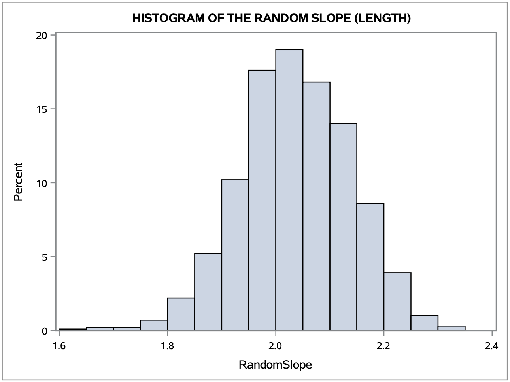
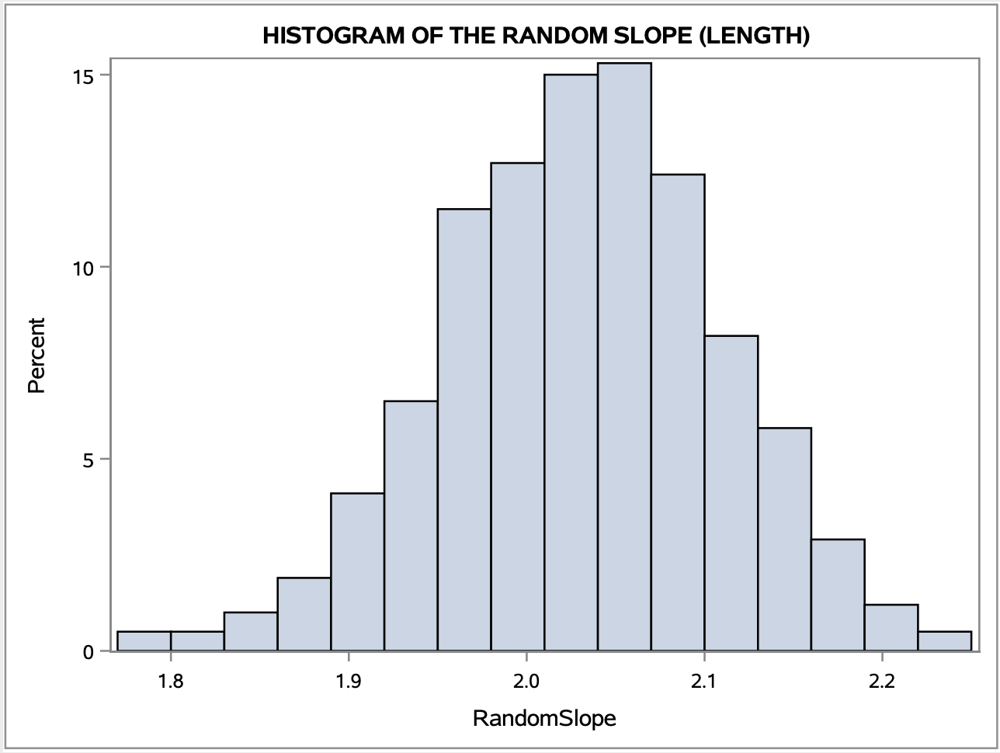

```{r, include=FALSE}
# Allow to include graphics in report.
options(tinytex.verbose = TRUE)
library(knitr)
library(doParallel)
library(parallel)
library(tidyverse)
```


#### General GitHub repository: [https://github.com/AMLoucas/MT5763_TOWANS](https://github.com/AMLoucas/MT5763_TOWANS)

#### Shiny GitHub repository: [https://github.com/janfor1/MT5763_Shiny](https://github.com/janfor1/MT5763_Shiny)

## Abstract

This project was divided into 4 different sections. For the **Shiny App** section we created a US stock analyzer that shows live us stock listings and prices in an interactive fashion. The app uses data from the Finnhub.io API, and allows the user to see changes in the stock over their chosen date range. It also displays information about the stock, recent news, and price targets. In the **Bootstrap** section we set out to create a more efficient version of the regBoot procedure in SAS. By making use of the SURVEYSELECT procedure and modifying other parts of the code, we were able to make the code significantly faster. For 100 loops, the new program executed in 0.04s as opposed to 2.44s for the old program, and the advantage held across a variety of loop sizes. In the **Jackknife** section our goal was to create efficient code for computing the jackknife estimate of the standard error of the mean of a variable. This was successful, as our macro produced the exact same result as the analytical estimate of the standard error for a dataset of seal lengths, and ran at an average of 0.308s per call. In the **Monte Carlo Simulation** section our goal was to use Monte Carlo simulation to investigate the sample variance of a particular sampling distribution, and consider the effects of a football tournament format.

## Introduction

  The overall purpose of this project is to display the programming skills acquired in SAS and R, while making use of version control through GIT to ensure proper documentation. We worked as a team to produce the deliverable for each task. There are 4 independent tasks that we worked to complete. 
  
  For the **Shiny App** task we decided as a group to create a shiny application using a stock exchange API. The purpose was to create a user-friendly API that updates each hour, or when the user presses a refresh button. Goals in this task included making the app as interactive as possible, and ensuring that the data was easily digestible for the user. 
  
  The purpose of the **Bootstrap** task was to optimize existing SAS bootstrap code from the regBoot.SAS file in order to make it faster. In order to determine that the task was successful, we had to obtain and visualize 95% confidence intervals, as well as compare the speed of the new code with the original code provided by implementing it for some seal length data. 
  
  In the **Jackknife** task, our goal was to code a Jackknife algorithm for computing an estimate of the standard error of the sample mean, and then implement it on the seal length data. To know that we had suceeded, we then needed to compare our estimate with the analytical estimate. A secondary goal was to ensure that the code was efficient enough to run on larger data sets. 

  For the **Monte Carlo Simulation** task, we had to code and implement two Monte Carlo Simulations using R. The purpose of one of the simulations was to derive a sampling distribution for the probability that a particular normal random variable was greater than a particular uniform random variable, and investigate how the sample variance of that distribution changed with respect to the number of simulations. The purpose of the other simulation was to determine the effect of a football tournament format on the observed win rate of teams relative to their assumed win rate. A secondary objective in both tasks was to make use of parallel computation to ensure that the simulations ran efficiently or alternatively, show that parallel computation was not useful in this application.  


## 1 Developing a Shiny App (R)

**Link to Shiny GitHub repository:** https://github.com/janfor1/MT5763_Shiny.git \
**Link to Shiny App:** https://janforschner.shinyapps.io/mt5763_shiny/

For the Shiny question in this project, we have created a **US Stock Analyser** app. This app gives a live overview of the stock market data for more than 8000 publicly listed US companies as well as additional analyst recommendations, organisation details and relevant market news. The app uses data from the free version of the Finnhub.io API.

### 1.1 Functionality
The US Stock Analyser Shiny app uses relevant user inputs and API data to display corresponding stock and company data.

On the **server** side, *eventReactive* functions are used to access, load and manipulate relevant API data, before putting it into appropriate data frames. The reactive functions are designed such that they only re-run the code, if one of the corresponding inputs is modified or the data is refreshed (either using the Refresh button or the 1 hour refresh timer). We have also added relevant error messages for invalid inputs and missing data. In addition, the server includes the different *outputs* including Plotly plots (allowing for user interaction), HTML output for text displayed in the app, outputs for the value boxes and the download button functionality.

In the **UI** document, we have included the inputs and UI elements as well as the main body output elements of the app. We have decided to use the dashboard layout (as opposed to the original layout), as this displays of the data in a more effective way and also results in a better design. The sidebar includes relevant user inputs, the refresh and download button as well as help text for the data input. The main dashboard itself uses value boxes, normal dashboard boxes and tabb boxes to display the different graphs and data output.

Finally, we have made use of the **global.R** document to make the server code cleaner and more concise. This file is responsible for loading all required packages, as well as defining functions for data wrangling and error messages that are used in the server file. The app also includes a **Readme.md** file as well as a **DESCRIPTION** file. The Readme.md file provides a brief description and instructions for using the app, while the DESCRIPTION file gives app details and allows for the app to be launched in Showcase Mode.

### 1.2 Using the Shiny app

The user can interact with the Shiny app in a variety of ways. The available data inputs as well as the outputs shown on the dashboard are explained in details below.

#### Sidebar

```{r, echo=FALSE, fig.align='center',  out.width="95%", out.height="95%"}
knitr::include_graphics("Shiny_Screenshots/Navbar.png")
```

The sidebar is located on the left of the app dashboard and includes several data inputs and buttons as explained below. It can also be hidden by pressing the button (3 horizontal white lines) next to the app name.

1. **Stock Name:** Stock name/ticker input field that accepts compatible US letter stock codes (such as AAPL, AMZN, GOOGL, etc.). The field shows suggestions for the 8000+ supported stocks as the user types and ensures only compatible names are entered.
2. **Search Button:** The search button is used to confirm the stock selection on the *Stock Name* field and load the relevant data.
3. **NASDAQ Stock Names:** This button opens a list of NASDAQ listed companies with their respective stock names in a new tab.
4. **Stock Date Range:** The date range selector allows the x-axis (date/time) limits for the candlestick plot and the Time-Series plot to be selected.
5. **Resolution:** Here the user can select the resolution for the candlestick plot and the Time-Series plot (i.e. the time intervals for which the financial data is downloaded and shown), ranging from 1 minute to 1 month. The note below the input field, details the limitations for certain time frames and resolutions.
6. **Refresh Button:** Users can press the refresh button to manually update all stock data and reload the relevant output. In addition, there is a 1 hour refresh timer, that automatically refreshes the data every hour.
7. **Last Updated Info:** The text below the *Refresh Button* indicates the last time that stock data has been updated.
8. **Download Stock Data Button:** Pressing this button will download stock data (time/date, open, close, low, high) as a csv file for the currently selected stock, date range and resolution.

There are restrictions on the date range and resolutions that are explained in the sidebar. In particular, resolutions smaller than 1 day are not available for 2019 and earlier and the date range for such graphs is limited to a maximum of 3 months. Also, it should be noted that the resolution must be smaller than the selected date range (i.e. if 1 day is selected a resolution of 1 month will return an error) and that the end date must be after the start date. If the input values are invalid or violate these rules, custom error messages will be shown informing the user.

#### Dashboard

The US Stock Analyser dashboard is the section of the app, where all relevant data is displayed. The individual outputs are explained here.

```{r, echo=FALSE, fig.align='center',  out.width="95%", out.height="95%"}

```

1. **Current Price:** Displays the current stock price (at last update time/date) for the selected stock in USD.
2. **Daily Low:** Shows the minimum stock price for the day in USD (or previous trading day in case of bank holidays or weekends).
3. **Daily High:** Gives the maximum stock price for the day in USD (or previous trading day in case of bank holidays or weekends).
4. **Candlestick Tab (default):** Displays an interactive candlestick chart for the chosen stock, date range and resolution. Hovering over individual data points will give relevant prices (open, close, high, low) for the given period. The slider controls underneath the x-axis can be used to manually adjust the date range shown.
5. **Time-Series Tab:** Shows an interactive time-series graph for the selected stock, date range and resolution. Again hovering over the line will indicate the stock price at the different time intervals.
6. **Analysis Tab:** If available, this provides an interactive bar chart of the analyst recommendations (stong sell, sell, hold, buy or stock buy) for the selected stock over the past 6 months. Hovering over the chart will give details for the individual months.

```{r, echo=FALSE, fig.align='center',  out.width="95%", out.height="95%"}

```

7. **Company Info:** This dashboard box provides company information for the selected stock including name, website, market cap, etc. If available, the company logo is also displayed.
8. **Stock Price Target:** If available for the selected stock, this output provides the 12 month stock price targets predicted by analysts (high, low and mean) in USD.
9. **Company News:** In this box, the 5 latest company news articles (but no older than 4 weeks) for the selected stock are displayed, with links to the relevant articles.

Given API limitations, not all data shown will be available for all stocks. In particular, for stocks of very small companies the analyst recommendations, price targets, company info and/or company news may be unavailable. In this case custom relevant error messages are displayed.

### 1.3 Summary

The US Stock Analyser shiny app uses API data and user inputs (stock name, date range and resolution) to display current stock quotes, stock price charts, analyst predictions and recommendations as well as company data and news. The plot are interactive, allowing user to see details for individual data points. In addition, the app has a refresh (button and automatic hourly refresh) and download functionality. Relevant explanations and error messages help the user to select adequate inputs and interpret the displayed outputs.


## TASK-2 [Bootstrap (SAS)]

  In this exercise question we were provided a not very efficient bootstrap code. We had to modify the code in pursuing a more efficient bootstrap algorithm. We applied 4 main changes that optimized and made our bootstrap code more efficient. \
  
 * **We did not manually compute the number of rows of the original dataset.** \

When applying the simulation, we want our sample data to have the same number rows as the original dataset. In the provided code the number of rows are obtained using the below chink of code: \
```{eval=FALSE}
/*Number of rows in my dataset*/
 	data _null_;
  	set &DataSet NOBS=size;
  	call symput("NROW",size);
 	stop;
 	run;
```
In the updated version, we do not use this approach. The in-built SAS function surveyselect supplies a field/method that automatically computes the number of rows of the dataset you are applying re-sampling on. The method name is "SAMPRATE = <placeholder> ". By assigning the value 1 or 100 in the placeholder's position, the number of rows will be computed for you. \
```{eval=FALSE}
PROC SURVEYSELECT 
	data=&DataFile
	out=WORK.bootData seed=23434
	/* SAMPRATE = HELPS US NO NEED TO FIND THE OBSERVATION SETS SIZE. FINDS ITS FOR US */
	/* REP = IS THE NUMBER OF TIMES YOU WANT THE SIMULATION TO OCCUR */
	/* METHOS = IS TO CREATE THE SAMPLES IN RANDOM UNIFORM WAY */
	/* OUTHITS = ENSURES EACH RECORD IS SAVED, RATHER THAN JUST 1 SIMULATION */
	method=urs noprint SAMPRATE=1 outhits rep=&SampleSet;
RUN;
```

  * **We did not use a loop to accomplish our N re-sampling simulations.** \

In the code provided the different simulation of bootstrapping is computed with a "for loop" . This was not a good approach, because the algorithm would need to apply re-sampling for every loop, this was be repeated for our N number of simulations. A more efficient approach is to compute all the bootstrap simulations in advance and apply the computation on the dataset at once. We computed all our N bootstrap simulations using a  the in-built SAS function surveyselect. The name of the field/method is "rep = <placeholder> ", we assigned "rep" with the number of bootstrap re-sampling datasets we want to construct. \
```{eval=FALSE}
/* Bootstrap loop for simulating data */
PROC SURVEYSELECT 
	data=&DataFile
	out=WORK.bootData seed=23434
	/* SAMPRATE = HELPS US NO NEED TO FIND THE OBSERVATION SETS SIZE. FINDS ITS FOR US */
	/* REP = IS THE NUMBER OF TIMES YOU WANT THE SIMULATION TO OCCUR */
	/* METHOS = IS TO CREATE THE SAMPLES IN RANDOM UNIFORM WAY */
	/* OUTHITS = ENSURES EACH RECORD IS SAVED, RATHER THAN JUST 1 SIMULATION */
	method=urs noprint SAMPRATE=1 outhits rep=&SampleSet;
RUN;
```

 * **We did not fit the linear model 1-by-1 for each sample dataset.** \

Because we used "rep", the sample dataset constructed was supplied with an extra column called "REPLICATE". This field holds an integer value that indicates in which re-sampling iteration the row/data belongs to. We could than apply a model for each re-sampled dataset at once, with no need to iterate through each dataset and fit a model 1-by-1. This was accomplished by the command line "BY REPLICATE". This would automatically divide the datasets with the replicate value and fit the regression model using each iterations values. \
```{eval=FALSE}
/* Create model for each loop/simulation */
PROC REG data=WORK.bootData 
	outest=WORK.ESTIMATES  noprint;
	Model &Y=&X;
	/* REPLICATE = VARIABLE THAT WORKS AS A SIMULATION INDEX. ALL RANDOM SAMPLES
		FROM THE SAME SIMULATION HOLD THE SAME REPLICATE VALUE */
	/* BY REPLICATE = MEANS A MODEL WILL BE FITTED FOR EACH SIMULATION THAT WAS APPLIED */
	BY Replicate;
RUN;
QUIT;
```

 * **We did not append our estimates results 1-by-1 for each iteration.** \
 
Since we used the "BY REPLICATE" command line, we had all our model results in one table at once.We extracted a subset from the fitted models result table that we were interested in one command line. We did not need to extract our fields of interest for each iteration and append it in a different table. \
```{eval=FALSE}
/*Extract just the columns for slope and intercept for storage */
DATA WORK.ESTIMATES;
	SET WORK.ESTIMATES;
	/* Keeping 2 columns of interest and renaming to appropriate names */
	KEEP Intercept &X;
	RENAME Intercept=RandomIntercept &X=RandomSlope;	
RUN;
```
These were all the changes that were applied to modify the bootstrap algorithm and make it more efficient. We then ran simulation test with different number of N iterations. We used timers to calculate the time needed to execute the bootstrap function in isolation. \
Below you can find the table that holds the different times for each N on both algorithm files. \
The "regBootUpdated" is the modifies more effiecient bootstrap. \

|    N   	|   regBoot  	| regBootUpdated 	|
|:------:	|:----------:	|:--------------:	|
|   20   	| 0:00:00.59 	|   0:00:00.04   	|
|   100  	| 0:00:02.44 	|   0:00:00.04   	|
|   500  	| 0:00:11.71 	|   0:00:00.09   	|
|  1000  	| 0:00:23.78 	|   0:00:00.11   	|
|  5000  	| 0:01:59.56 	|   0:00:00.41   	|
|  10000 	| 0:04:01.78 	|   0:00:00.79   	|
|  20000 	| 0:08:42.88 	|   0:00:01.53   	|
|  50000 	| 0:23:31.36 	|   0:00:03.69   	|
| 100000 	|    NULL    	|   0:00:07.79   	|

From the table with the recorded times, we can conclude that the updated version (regBootUpdated)
is indeed more efficient. The times have a huge difference, for the large values of N we can see a very big difference. The supplied bootstrap took 23 minutes to execute N = 50000, while the updated version needed only 3 minutes and 69 seconds. \
 \
In addition to making the algorithm more efficient, we had to compute the 95% Confidence intervals for the parameter estimates of interest. These values can be computed using the SAS in-built function of UNIVARIATE. We calculated the 95% confidence intervals from both programs. \
```{eval=FALSE}
/* GET THE 95% CI of our estimates*/
PROC UNIVARIATE 
	data=WORK.ESTIMATES;
	VAR RandomIntercept;
	OUTPUT out=WORK.InterceptCI pctlpts=2.5, 97.5 pctlpre=CI; /* 95% CI */
RUN;

PROC UNIVARIATE 
	data=WORK.ESTIMATES;
	VAR RandomSlope;
	OUTPUT out=WORK.SlopeCI pctlpts=2.5, 97.5 pctlpre=CI; /* 95% CI */
RUN;
```
The result of our 95% confidence intervals together with a histogram of all the parameter estimates the simulation calculated can be found below. \

**regBootUpdated** \

| CI    | RandomSlope | RandomIntercept |
|:----: |:-----------:|:---------------:|
| 2.5%  |   1.845   	|     74.942     	|
| 97.5% |   2.228   	|    117.238   	  |

**Histograms for the paramater estimates from regBootUpdated**
```{r, echo=FALSE, fig.align='center',  out.width="70%", out.height="70%"}
# All defaults
include_graphics("TASK1/Intercept-estimate-regUpdate.png")

```

**regBoot** \

| CI    | RandomSlope | RandomIntercept |
|:----: |:----------:	|:---------------:|
| 2.5%  |   1.869   	|     79.696     	|
| 97.5% |   2.189   	|    114.162   	  |

**Histograms for the paramater estimates from regBoot**
```{r, echo=FALSE, fig.align='center',  out.width="70%", out.height="70%"}
# All defaults
include_graphics("TASK1/Intercept-estimate.png")

```

We then fitted a model on the provided dataset without applying a re-sampling algorithm on it. Our Intercept estimate value was approximately *96.153* and our Slope value was approximately *2.036* . We can see that the confidence intervals from Bootstrap algorithms contain the values and is approximately located in the middle of both of the histograms. This indicates our bootstrap results are "good", we also noticed that the two different bootstrap confidence intervals differ in values and width. This is due to the fact that every time we run the re-sampling software, new random sample data is constructed. You will have different results for both every time you execute the code. In general, both codes do the same procedure, the only difference is that regBootUpdated does it in a more efficient way. To obtain more precise confidence intervals, you will have to increase the number of simulations *N* you want apply. The larger the value of *N* the closer our confidence intervals will be to the true parameter. \


## 3 Jackknife (SAS)

For this section we demonstrate a SAS program for obtaining the jackknife estimate of the standard error for the mean of given data. The SAS macro created for this purpose proceeds in the following fashion:

### 3.1 Jackknife Macro

First we extract the sample mean and the size of the dataset. Then we use the SURVEYSELECT process to create a dataset containing n copies of the original data. We also create a dataset containing n copies of the sample mean, as we will later need to compute the difference between each of the jackknife samples and the sample mean.  

```{eval=FALSE}
FILENAME REFILE '/folders/myfolders/sasuser.v94/seals.csv';

PROC IMPORT DATAFILE=REFFILE
	DBMS=CSV
	OUT=WORK.SEALS;
	GETNAMES=YES;
RUN;

PROC CONTENTS DATA=WORK.SEALS;
RUN;


/*Jackknife Function
	INPUTS
	DataFile: the dataset to perform the analysis on
	X: the variable we want to analyze
	OUTPUTS
	estimate for standard error
	*/
%MACRO jackKnife(Datafile, X);

/*command for extracting the sample mean*/
PROC UNIVARIATE DATA=&DataFile noprint; 
VAR &X;
OUTPUT out=MEANX mean=sampmean;
RUN;

/*need to acquire size of the dataset (n) to know how many replicates will be needed*/
PROC SQL NOPRINT;
SELECT count(*) into :size from &DataFile;
QUIT;
    
/*obtain a dataset which is the sample mean repeated n times for later calculation*/
PROC SURVEYSELECT DATA=MEANX OUT=SAMPMEAN
method=srs samprate=1 rep=&SIZE. ;
RUN;
	
/*obtain n replications of the original data set*/
PROC SURVEYSELECT DATA=&DataFile OUT=VecLong
method=srs samprate=1 rep=&SIZE. ;
RUN;
```

We then delete sample i for each ith replication of the original data to create the jackknife sample, and then obtain the squared difference with the sample mean for each jackknife sample.

```{eval=FALSE}
/*delete sample i for each ith replication*/
DATA VecJack / VIEW = VecJack;
SET VecLong;
if replicate=mod(_n_,&SIZE.)+1 then delete;
RUN;
 
/*obtain the mean of each jackknifed sample*/
PROC UNIVARIATE data=VecJack noprint; 
VAR &X;
BY replicate;
OUTPUT out=jackMeans mean=mean;
RUN;
    
/*obtain the squared difference from the sample mean*/
DATA SquareDiffs;
MERGE jackMeans SampMean;
BY replicate;
SquareDiff = (mean - sampmean)**2;
RUN;
```

Finally, we sum the squared differences and calculate the standard error, storing it in a dataset called Estimate. 

```{eval=FALSE}
/*get the sum of the squared differences*/
PROC SUMMARY DATA=SquareDiffs;
VAR SquareDiff;
OUTPUT out=TotalDiffs sum=tot;
RUN;
	
/*calculate the standard error for storage*/
DATA Estimate;
SET TotalDiffs;
SE = SQRT((&SIZE. - 1) / &SIZE. * tot);
KEEP SE;
RUN;
 	
%MEND;

OPTIONS NONOTES;

/* Calling function */
%jackKnife(WORK.SEALS, Lengths)
```

### 3.2 Standard Error Calculation and Efficiency Comparison

We also wrote the following SAS program in order to calculate the analytical estimate for standard error of mean length of the seals.

```{eval = FALSE}
%MACRO SE(Datafile, X);

PROC MEANS DATA = &Datafile STDERR;
VAR &X;
output out = StandardEstimate stderr=SE;
RUN;

%MEND;

/* Calling function */
%SE(WORK.SEALS, Lengths)
```

We then ran the following code in order to compare the efficiency of our two processes.

```{eval=FALSE}
%MACRO loopjack(N);
%do i=1 %to &N;
%Jackknife(WORK.SEALS, Lengths);
%end;
%mend;

%MACRO loopSE(N);
%do i=1 %to &N;
%SE(WORK.SEALS, Lengths);
%end;
%mend;


/* Start the times, to count the function */
%let _timer_start = %sysfunc(datetime());

/* Calling function many times for robust estimate */
%loopSE(20);
RUN;
 	
/* Stop timer, obtain time taken to execute program */
data _null_;
  dur = datetime() - &_timer_start;
  put 30*'-' / ' TOTAL DURATION:' dur time13.2 / 30*'-';
run;

/* Start the times, to count the function */
%let _timer_start = %sysfunc(datetime());

/* Calling function many times for robust estimate */
%loopjack(20);
RUN;
 	
/* Stop timer, obtain time taken to execute program */
data _null_;
  dur = datetime() - &_timer_start;
  put 30*'-' / ' TOTAL DURATION:' dur time13.2 / 30*'-';
run;
```

### 3.3 Jackknife Final Results

| Method     | Average Time Taken, s (n=20) | SE Estimate, cm |
|------------|------------------------------|-----------------|
| Analytical |                0.096         |   0.5537712468  |
| Jackknife  |                0.308         |   0.5537712468  |

As we can see here our Jackknife process is slightly less efficient than calculating the standard error analytically. We found the exact same value for the standard error as the analytical method so we can infer that we have a reliable estimate. 


## TASK-4 [Monte Carlo simulation (R)]
The problems in task 4 involved writing efficient R code to solve two problems using Monte Carlo simulation.  Problem A explores distribution of random variables and Problem B explores the varying outcomes of a football tournament and the associated probabilities.

#### Problem-A 


#### Problem-B 
This problem considers a football tournament where a team keeps playing until they accrue 7 wins **or** 3 losses, with no draws allowed.

### 4.2.1 Tournament Simualtion Construction
To allow for simulation of results from the tournament detailed above, a "tournament" function was designed and implemented. The function takes win rate (p), which is fixed across all rounds, as an input and unless specified will take a randomly generated p ∈ [0, 1]. The function simulates the results of the tournament for a specified number of replicates, and stores the total number of wins, losses, matches played and the probability used in the simulation(s), returning them as a list in the output.

``` {r}
# function takes fixed p between 0 and 1 and 1 replicate as default 
tournament <- function(p = runif(1, min = 0, max = 1), NRepeat = 1) {
                    
  totalWins <- rep(NA, NRepeat)       # win store
  totalLosses <- rep(NA, NRepeat)     # loss store
  totalMatches <- rep(NA, NRepeat)    # matches store
  
  # run tournament
  set.seed(231215)             # reproducibility
  
  for (i in seq(NRepeat)) {
    nWins <- 0                   # set win counter
    nLosses <- 0                 # set loss counter
  
    while(nLosses < 3 & nWins < 7) {      # set stopping condition
        result <- rbinom(n = 1, size = 1, prob = p)   # simulate game result
       
        if (result == 0) {  # 0 - loss
          nLosses <- nLosses + 1
        }
        
        if (result == 1) { # 1 - win
          nWins <- nWins + 1
        }
        
        nMatches <- nWins + nLosses            # find number of matches
    }
    
    totalLosses[i] <- nLosses              # record wins, losses, matches and probabilities
    totalWins[i] <- nWins                  
    totalMatches[i] <- nMatches
  
  }
  return(list(losses = totalLosses,         
              matches = totalMatches,
              wins = totalWins, 
              probability = p
             ))
}


```

The output of a single run of the tournament for a fixed p is shown below:

```{r, echo = FALSE}

tournament()

```

### 4.2.2 How number of matches varies as a function of p 
By first creating a sequence of win rates (p) from 0 to 1 in increments of 0.01 then simulating 10000 tournament replicates and taking the average number of matches played, for each p, a plot was created displaying how the number of matches played varies with p.
``` {r, echo = FALSE, message = FALSE, fig.align = "center", fig.cap = "Plot showing how the number of matches varies as a function of p. Each point represents the average number of matches played over 10000 tournament replicates for each p. Overlain is the (blue) curve fitted to the data"}
#Plot how the total number of matches played (i.e. wins + losses) 
#varies as a function of p.

pseq <- seq(0,1,0.01) # probability sequence

# Parallelise
nCores <- 8 # no. of cores
cl <- makeCluster(spec = nCores, type = "PSOCK")
registerDoParallel(cl)

averages <- foreach(p = pseq, .combine='rbind', .multicombine=TRUE) %dopar% {
  sim <- tournament(p, 10000)
  p <- p
  matches <-(mean(sim$matches))
  rate <- (mean(sim$wins/sim$matches))
  data.frame(p, matches, rate)
}


ggplot(averages, aes(x = p, y = matches)) +     # plot total matches against probability
  geom_point() +
  xlab("Assumed win rate") +
  ylab("Total Number of Matches") +
  ggtitle("Number of matches vs Assumed win Rate") +
  geom_smooth(se = FALSE) +
  scale_x_continuous(breaks = seq(0,1,0.1)) +
  scale_y_continuous(breaks = seq(min(averages$matches), max(averages$matches) + 1)) 


```

### 4.2.3 Observed win rate relative to the assumed win rate
To explore the differences between the observed win rate and the assumed win rate (p), using the 10000 tournament simulations for each p, the average win rate was calculated by finding the number of wins divided by the number of matches played and taking an average for each p. The plot of this data is shown below:

```{r, echo = FALSE, message = FALSE, fig.align = "center", fig.cap = "Plot showing how the observed win rate compares to the assumed win rate.Each point represents the (average) observed win rate for each p with a fitted line overlain in blue. The black line represents observed win rate = assumed win rate."}

# plots to back up commentary 
ggplot(averages, aes(x = p, y = rate)) +     # plot win rate against probability
  geom_point() +
  xlab("Assumed win rate") +
  ylab("Observed win rate") +
  ggtitle("Observed Win Rate v Assumed win rate") +
  geom_smooth(se = FALSE) +
  geom_abline(aes(intercept = 0, slope = 1)) +
  scale_x_continuous(breaks = seq(0,1,0.1)) +
  scale_y_continuous(breaks = seq(0,1,0.1))

```
From the plot is can be seen that only at very low probabilities and at high probabilities does the expected data fit as would be expected, with the observed win rate being lower than the assumed win rate for values within the region of around [0.01, 0.85] and appearing to be slightly higher within the region of around [0.87, 0.98]. Given that the structure of the tournament is such that losses are "favoured" since a team must accrue over twice as many wins as losses for the tournament to end as a result of wins, it is more likely that a teams stop playing as a result of losses. This means that for lower assumed win rates, teams will be losing more games than they are winning and the tournament will likely be stopped based on number of losses. As assumed win rate increases, the observed win rate increases closer to the assumed rate as teams should be winning more games and have more chance of ending the tournament as a result of accruing 7 wins. Despite this increase, the observed win rate will likely stay below the assumed win rate since although teams with p > 0.5 should expect to win more games than they lose, they can only play more games if the team stays below the 3 losses threshold, and so even if a team over 10 games was to win 7 and lose 3, such is the structure of the tournament that losses occurring before the wins will minimise the observed win rate.

To gain a better understanding of behavior at high assumed win rates, the following plot was created of the observed differences between the assumed win rates and the observed win rates, varying across p.
```{r, echo = FALSE, message = FALSE, fig.align = "center", fig.cap = "Plot showing how the observed difference in win rate  varies with assumed win rate. Each point represents the observed difference for each p (observed win rate - assumed win rate"}

ggplot(averages, aes(x = p, y = (rate-p))) +     # plot win rate against probability
  geom_point() +
  xlab("Assumed win rate") +
  ylab("Observed Difference") +
  ggtitle("Observed differences between assumed win rate and observed win rate") +
  scale_x_continuous(breaks = seq(0,1,0.1)) 


```
The negative observed differences are as a result of the conclusions drawn from the previous plot. This plot highlights that fpr high assumed win rates, around [0.8, 0.99] the observed win rate is higher than the assumed win rate. The likely explanation for this is again down to the format of the tournament. At an assumed win rate of 1, a team will win every game, every time and end the tournament as a result of winning all 7 matches they play and so observed win rate = assumed win rate. However, for the higher assumed win rates that are still less than 1, it remains a possibility that a team will win close to, if not, all of their games. This will result in an observed win rate that is higher than the assumed rate.

### 4.2.4 Parallelisation 
In order to make the code in this section as efficient as possible, the effect of parallelisation was considered when simulating a large number of replicates (100 probabilities, 10000 times each). The method was carried out using a parallelised and a non-parallelised method and the time taken for both methods to run were compared.

The run time on the parallelised method was found to be consistently lower than the non-parallised method, and so it was this method that was used within analyses.

For the parallelised method, a typical run time was:

``` {r, echo = FALSE}
# Initialisation
pseq <- seq(0,1,0.01) # probability sequence

# Parallelise
nCores <- 8 # no. of cores
cl <- makeCluster(spec = nCores, type = "PSOCK")
registerDoParallel(cl)

start <- Sys.time()
averages <- foreach(p = pseq, .combine='rbind', .multicombine=TRUE) %dopar% {
  sim <- tournament(p, 10000)
  p <- p
  matches <-(mean(sim$matches))
  rate <- (mean(sim$wins/sim$matches))
  data.frame(p, matches, rate)
}
end <- Sys.time()
end-start

```
And for the non-parallelised method, a typical run time was:

``` {r, echo = FALSE, warning = FALSE}

pseq <- seq(0,1,0.01) # probability sequence
 
averages <- data.frame(p = pseq, matches = rep(NA,101), rate = rep(NA,101))
start <- Sys.time()
for (p in pseq){
  sim <- tournament(p, 10000)
  averages[which(averages$p == p),]$matches <- mean(sim$matches)
  averages[which(averages$p == p),]$rate <- mean(sim$wins/sim$matches)
}  
end <- Sys.time()
end-start
```

## Conclusion
Throughout this project we made use of R and SAS statistical software to create a Shiny web app, design and deploy an efficient bootstrapping and Jackknife method as well as to run Monte Carlo simulations to investigate sampling distributions and analyse the effect of different tournament formats in football.

### Collaboration & Using GitHub
For this project, each team member initially took responsibility for one of the tasks, based upon their programming experience, strengths and preferences. Each person focused on their own task to begin with, working towards the solution and deliverable. Throughout this process, team members also collaborated with each other for assistance and/or feedback regarding certain parts of the tasks. Once an initial draft was completed, each part was then presented to the entire team, allowing for corrections/feedback. This process enabled us to continuously improve upon our work.

For collaborative coding, we used a GitHub repository that was shared with the entire team. Separate folders were created for the 3 tasks (the Shiny app was stored in a separate repository) to provide a clear file structure. Using regular commits and Readme files ensured that everyone could clearly see how far each task was coming along and what conclusions and results have been obtained.

### Task Outcomes
For each task, we implemented the adequate code in R or SAS to produce the required deliverable and draw conclusions about the techniques investigated.

#### Shiny App (R)
For the Shiny task, we have created a US Stock Analyser app. This Shiny app imports data from a stock market API to display stock quotes, charts, analyst predictions as well as company information and news. The UI elements enable the user to select relevant inputs and to refresh and download the data. Stock market web apps such as this are used every day by traders, journalists and other stakeholders to keep track of the financial markets.

#### Bootstrapping (SAS)
In the bootstrapping section we modified the regBoot algorithm in SAS and used the SURVEYSELECT procedure to create a much more efficient bootstrapping method, enabling us to efficiently calculate coefficients for a linear model. This new procedure was able to run 50,000 loops of the bootstrap in just 3.69 seconds instead of more than 23 minutes for the original code. Improving the efficiency of code, such as done in this task, is essential for statisticians. Efficient algorithms in research or industry are essential, as programmers often work with very large number bootstrap samples and may be constrained by computing power due budget limitations.

#### Jackknife (SAS)
For the Jackknife task, we have created and implemented code for an efficient Jackknife method, to estimate the standard error of the mean seal lengths for the data provided. Our method provided an identical result to the analytic estimate, with a run time of just 0.308s. As with the bootstrap example, such methods are being used and furtehr developed by statisticians around the world to make the computation of statistical estimates more effciient.

#### Monte Carlo Simulations (R)
<!-- 2-3 sentences summarising findings and potential real world application-->

### Further Exploration
While working through this project and the respective tools and methods, we have identified several further avenues of exploration, that could be of interest in the subsequent studies.

* **Shiny App:** There are almost infinite possibilities with regards to expanding the features of the US stock analyser Shiny app. In particular, one could add technical stock market indicators (such as On-Balance volume and accumulation/distribution lines) as well as other ratios and tools used by financial analysts.

* **Bootstrap:** It would be of interest to investigate how the updated bootstrapping procedure could be applied to more than 1 covariate and if it is possible to make it even more efficient when working with an extremely large numebr of loops.

* **Jackknife:** 

* **Monte Carlo Simulation:** 


## APPENDIX
<!-- Full code snippets of the tasks -->


#### regBootUpdated CODE FOR TASK [2] BOOTSTRAP

```{eval=FALSE}
/* MT5763 GROUP PROJECT */
/* Updated bootstrap code to be faster */
FILENAME REFFILE '/folders/myfolders/sasuser.v94/GROUP-BootStrap/seals.csv';

PROC IMPORT DATAFILE=REFFILE
	DBMS=CSV
	OUT=WORK.SEALS_UPDATED;
	GETNAMES=YES;
	GUESSINGROWS=MAX;
RUN;

PROC CONTENTS DATA=WORK.SEALS_UPDATED; 
RUN;

/* Boostrap function
	Takes 4 arguments:
	DataFile -> Data file that contains data we will be working with
	X -> The predictor being used in model
	Y -> The response varibale being used in model
	SampleSet -> Number of sample sets to be created (number of loops)
	*/
%MACRO bootStrap(DataFile, X, Y, SampleSet);

/* Bootstrap loop for simulating data */
PROC SURVEYSELECT 
	data=&DataFile
	out=WORK.bootData seed=-23434
	/* SAMPRATE = HELPS US NO NEED TO FIND THE OBSERVATION SETS SIZE. FINDS ITS FOR US */
	/* REP = IS THE NUMBER OF TIMES YOU WANT THE SIMULATION TO OCCUR */
	/* METHOS = IS TO CREATE THE SAMPLES IN RANDOM UNIFORM WAY */
	/* OUTHITS = ENSURES EACH RECORD IS SAVED, RATHER THAN JUST 1 SIMULATION */
	method=urs noprint SAMPRATE=1 outhits rep=&SampleSet;
RUN;


/* Create model for each loop/simulation */
PROC REG data=WORK.bootData 
	outest=WORK.ESTIMATES  noprint;
	Model &Y=&X;
	/* REPLICATE = VARIABLE THAT WORKS AS A SIMULATION INDEX. ALL RANDOM SAMPLES
		FROM THE SAME SIMULATION HOLD THE SAME REPLICATE VALUE */
	/* BY REPLICATE = MEANS A MODEL WILL BE FITTED FOR EACH SIMULATION THAT WAS APPLIED */
	BY Replicate;
RUN;
QUIT;

/*Extract just the columns for slope and intercept for storage */
DATA WORK.ESTIMATES;
	SET WORK.ESTIMATES;
	/* Keeping 2 columns of interest and renaming to appropriate names */
	KEEP Intercept &X;
	RENAME Intercept=RandomIntercept &X=RandomSlope;	
RUN;

%MEND;

OPTIONS NONOTES;

/* Start the times, to count the function */
%let _timer_start = %sysfunc(datetime());

/* Calling function */
%bootStrap(DataFile = WORK.SEALS_UPDATED, X = Lengths, Y = Testosterone, SampleSet = 1000);

/* Stop timer, obtain time taken to execute program */
data _null_;
  dur = datetime() - &_timer_start;
  put 30*'-' / ' TOTAL DURATION:' dur time13.2 / 30*'-';
run;

/* GET THE 95% CI of our estimates*/
PROC UNIVARIATE 
	data=WORK.ESTIMATES;
	VAR RandomIntercept;
	OUTPUT out=WORK.InterceptCI pctlpts=2.5, 97.5 pctlpre=CI; /* 95% CI */
RUN;

PROC UNIVARIATE 
	data=WORK.ESTIMATES;
	VAR RandomSlope;
	OUTPUT out=WORK.SlopeCI pctlpts=2.5, 97.5 pctlpre=CI; /* 95% CI */
RUN;

/* WE PLOT ESTIMATES TO VIEW THE CI */  
PROC SGPLOT data = WORK.ESTIMATES;
	TITLE "HISTOGRAM OF THE RANDOM INTERCEPT";
	HISTOGRAM RandomIntercept;
RUN;
TITLE;

PROC SGPLOT data = WORK.ESTIMATES;
	TITLE "HISTOGRAM OF THE RANDOM SLOPE (LENGTH)";
	HISTOGRAM RandomSlope;
RUN;
TITLE;

```

#### CODE FOR TASK [3] Jackknifing
```{eval=FALSE}
/* MT5763 Group Project */
/* code for doing jackknife estimation */

FILENAME REFILE '/folders/myfolders/sasuser.v94/seals.csv';

PROC IMPORT DATAFILE=REFFILE
	DBMS=CSV
	OUT=WORK.SEALS;
	GETNAMES=YES;
RUN;

PROC CONTENTS DATA=WORK.SEALS;
RUN;


/*Jackknife Function
	INPUTS
	DataFile: the dataset to perform the analysis on
	X: the variable we want to analyze
	OUTPUTS
	estimate for standard error
	*/
%MACRO jackKnife(Datafile, X);

/*command for extracting the sample mean*/
PROC UNIVARIATE DATA=&DataFile noprint; 
VAR &X;
OUTPUT out=MEANX mean=sampmean;
RUN;

/*need to acquire size of the dataset (n) to know how many replicates will be needed*/
PROC SQL NOPRINT;
SELECT count(*) into :size from &DataFile;
QUIT;
    
/*obtain a dataset which is the sample mean repeated n times for later calculation*/
PROC SURVEYSELECT DATA=MEANX OUT=SAMPMEAN
method=srs samprate=1 rep=&SIZE. ;
RUN;
	
/*obtain n replications of the original data set*/
PROC SURVEYSELECT DATA=&DataFile OUT=VecLong
method=srs samprate=1 rep=&SIZE. ;
RUN;

/*delete sample i for each ith replication*/
DATA VecJack / VIEW = VecJack;
SET VecLong;
if replicate=mod(_n_,&SIZE.)+1 then delete;
RUN;
 
/*obtain the mean of each jackknifed sample*/
PROC UNIVARIATE data=VecJack noprint; 
VAR &X;
BY replicate;
OUTPUT out=jackMeans mean=mean;
RUN;
    
/*obtain the squared difference from the sample mean*/
DATA SquareDiffs;
MERGE jackMeans SampMean;
BY replicate;
SquareDiff = (mean - sampmean)**2;
RUN;
    
/*get the sum of the squared differences*/
PROC SUMMARY DATA=SquareDiffs;
VAR SquareDiff;
OUTPUT out=TotalDiffs sum=tot;
RUN;
	
/*calculate the standard error for storage*/
DATA Estimate;
SET TotalDiffs;
SE = SQRT((&SIZE. - 1) / &SIZE. * tot);
KEEP SE;
RUN;
 	
%MEND;

OPTIONS NONOTES;

/* Calling function */
%jackKnife(WORK.SEALS, Lengths)

%MACRO SE(Datafile, X);

PROC MEANS DATA = &Datafile STDERR;
VAR &X;
output out = StandardEstimate stderr=SE;
RUN;

DATA StandardEstimate;
SET StandardEstimate;
KEEP SE;
RUN;

%MEND;

/* Calling function */
%SE(WORK.SEALS, Lengths)

%MACRO loopjack(N);
%do i=1 %to &N;
%Jackknife(WORK.SEALS, Lengths);
%end;
%mend;

%MACRO loopSE(N);
%do i=1 %to &N;
%SE(WORK.SEALS, Lengths);
%end;
%mend;


/* Start the times, to count the function */
%let _timer_start = %sysfunc(datetime());

/* Calling function many times for robust estimate */
%loopSE(20);
RUN;
 	
/* Stop timer, obtain time taken to execute program */
data _null_;
  dur = datetime() - &_timer_start;
  put 30*'-' / ' TOTAL DURATION:' dur time13.2 / 30*'-';
run;

/* Start the times, to count the function */
%let _timer_start = %sysfunc(datetime());

/* Calling function many times for robust estimate */
%loopjack(20);
RUN;
 	
/* Stop timer, obtain time taken to execute program */
data _null_;
  dur = datetime() - &_timer_start;
  put 30*'-' / ' TOTAL DURATION:' dur time13.2 / 30*'-';
run;
```
 	
 	