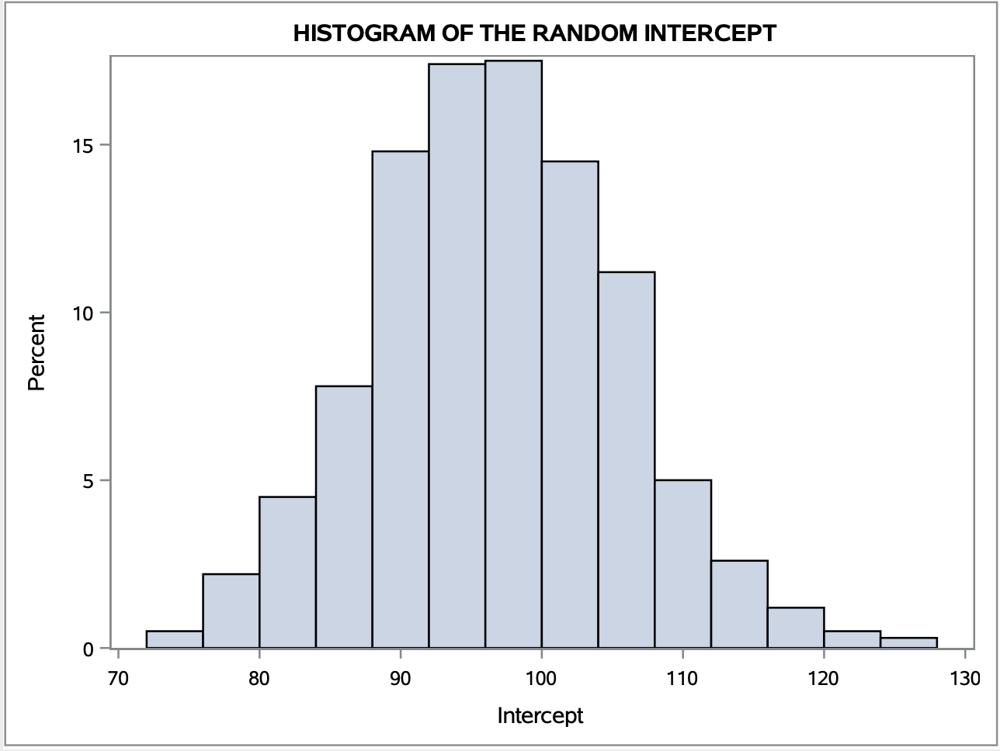

```{r, include=FALSE}
# Allow to include graphics in report.
options(tinytex.verbose = TRUE)
library(knitr)
```


#### General GitHub repository: [https://github.com/AMLoucas/MT5763_TOWANS](https://github.com/AMLoucas/MT5763_TOWANS)

#### Shiny GitHub repository: [https://github.com/janfor1/MT5763_Shiny](https://github.com/janfor1/MT5763_Shiny)


## Introduction

  The purpose of this project is to display the programming skills acquired in SAS, R and version control "GIT". We were working as a team to undertake each task to accomplish the deliverable. We had to perform our version control knowledge using GIT, to communicate and work on our tasks simultaneously. The project is divided into 4 individual independent tasks: \
  For task 1, we had to create a Shiny application in R. Our application communicates with a stock exchange API every one hour and pulls updated data. The user of the application has the functionality to request updated data before the hour mark and download the data he has acquired. Additionally, the software visualizes the data pulled from the API using graphs and plots. The user is capable to adjust the graphs to his preferences and examine the intervals he is mostly interested in. \
  For task 2, we were provided with a SAS bootstrap code and we had to optimize the code to make it faster. Once the code was optimized and the speed-up level has improved, we had to obtain and visualize the 95% confidence intervals for our two coefficients from the provided data and compare with the confidence intervals that the SAS built-in procedures offer. \
  For task 3, we had to code and implement a Jackknife algorithm using SAS. Once Jackknife was implemented we had to use the function to obtain the estimates of the standard error and mean of the provided data. After the simulations were accomplished we compared our results. \
  For task4, we had to write and implement a Monte Carlo Simulation using R. We had to use parallel computations in the implementation. We were provided with two different problem questions and we had to use our Monte Carlo Simulation results to answer them. \
  The data that was used in Task 2 & 3, is a fictional dataset of male hormone levels in seals of different lengths. \


## TASK-1 [Shiny app (R)]


## TASK-2 [Bootstrap (SAS)]

  In this exercise question we were provided a not very efficient bootstrap code and we had to modify the code, resulting to a more efficient bootstrap. We applied 4 main changes that optimize and make our bootstrap code more efficient. \
  
 * **We did not manually compute the number of rows of the original dataset.** \

When applying the simulation, we want our sample data to have the same number rows as the original dataset. In the provided code the number of rows are obtained using code: \
```{eval=FALSE}
/*Number of rows in my dataset*/
 	data _null_;
  	set &DataSet NOBS=size;
  	call symput("NROW",size);
 	stop;
 	run;
```
In the updated version, we do not use this approach. The in-built SAS function surveyselect supplies a field/method that automatically computes the number of rows of the dataset you are applying re-sampling. The method name is "SAMPRATE = ?? ". By assigning this field with the value 1 or 100, the number of rows will be computed for you. \
```{eval=FALSE}
PROC SURVEYSELECT 
	data=&DataFile
	out=WORK.bootData seed=23434
	/* SAMPRATE = HELPS US NO NEED TO FIND THE OBSERVATION SETS SIZE. FINDS ITS FOR US */
	/* REP = IS THE NUMBER OF TIMES YOU WANT THE SIMULATION TO OCCUR */
	/* METHOS = IS TO CREATE THE SAMPLES IN RANDOM UNIFORM WAY */
	/* OUTHITS = ENSURES EACH RECORD IS SAVED, RATHER THAN JUST 1 SIMULATION */
	method=urs noprint SAMPRATE=1 outhits rep=&SampleSet;
RUN;
```

  * **We did not use a loop to accomplish our N re-sampling simulations.** \

In the code provided the different simulation of bootstrapping is computed with a "for loop" . This was not a good approach, because the algorithm would obtain the re-sampled data and apply computations on it. This would be repeated for our N number of simulations. A more efficient approach is to compute all the bootstrap simulations in advance and apply the computation on the datasets at once. We computed all our N bootstrap simulations using a field/method from the in-built SAS function surveyselect. The name of the field/method is "rep = ?? ", we assigned "rep" with the number of bootstrap re-sampling datasets we want to construct. \
```{eval=FALSE}
/* Bootstrap loop for simulating data */
PROC SURVEYSELECT 
	data=&DataFile
	out=WORK.bootData seed=23434
	/* SAMPRATE = HELPS US NO NEED TO FIND THE OBSERVATION SETS SIZE. FINDS ITS FOR US */
	/* REP = IS THE NUMBER OF TIMES YOU WANT THE SIMULATION TO OCCUR */
	/* METHOS = IS TO CREATE THE SAMPLES IN RANDOM UNIFORM WAY */
	/* OUTHITS = ENSURES EACH RECORD IS SAVED, RATHER THAN JUST 1 SIMULATION */
	method=urs noprint SAMPRATE=1 outhits rep=&SampleSet;
RUN;
```

 * **We did not fit the linear model 1-by-1 for each sample dataset.** \

Because we used "rep", the sample datasets constructed were supplied with an extra column called "REPLICATE". This field holds an integer value that indicates in which re-sampling iteration the row/data belongs to. We could than apply a model for each re-sampled dataset at once, with no need to iterate through each dataset and fit a model 1-by-1. This was accomplished by the command line "BY REPLICATE". This would automatically divide the datasets with the replicate value and fit the regression model using each iterations values. \
```{eval=FALSE}
/* Create model for each loop/simulation */
PROC REG data=WORK.bootData 
	outest=WORK.ESTIMATES  noprint;
	Model &Y=&X;
	/* REPLICATE = VARIABLE THAT WORKS AS A SIMULATION INDEX. ALL RANDOM SAMPLES
		FROM THE SAME SIMULATION HOLD THE SAME REPLICATE VALUE */
	/* BY REPLICATE = MEANS A MODEL WILL BE FITTED FOR EACH SIMULATION THAT WAS APPLIED */
	BY Replicate;
RUN;
QUIT;
```

 * **We did not append our estimates results 1-by-1 for each iteration.** \
 
Since we used the "BY REPLICATE" command line, we had all our model results in one table at once.We extracted a subset from the fitted models result table that we were interested in one command line. We did not need to pull our fields of interest for each iteration and append it in a different table. \
```{eval=FALSE}
/*Extract just the columns for slope and intercept for storage */
DATA WORK.ESTIMATES;
	SET WORK.ESTIMATES;
	/* Keeping 2 columns of interest and renaming to appropriate names */
	KEEP Intercept &X;
	RENAME Intercept=RandomIntercept &X=RandomSlope;	
RUN;
```
These were all the changes that were applied to modify the bootstrap algorithm and make it more efficient. We then run simulation test with different number for N iterations. We used timers to calculate the time needed to execute the whole bootstrap function. The table that holds the different times for each N on both algorithms is appended below. \


|    N   	|   regBoot  	| regBootUpdated 	|
|:------:	|:----------:	|:--------------:	|
|   20   	| 0:00:00.59 	|   0:00:00.04   	|
|   100  	| 0:00:02.44 	|   0:00:00.04   	|
|   500  	| 0:00:11.71 	|   0:00:00.09   	|
|  1000  	| 0:00:23.78 	|   0:00:00.11   	|
|  5000  	| 0:01:59.56 	|   0:00:00.41   	|
|  10000 	| 0:04:01.78 	|   0:00:00.79   	|
|  20000 	| 0:08:42.88 	|   0:00:01.53   	|
|  50000 	| 0:23:31.36 	|   0:00:03.69   	|
| 100000 	|    NULL    	|   0:00:07.79   	|

From the table with the recorded times, we can conclude that the updated version (regBootUpdated)
is indeed more efficient. The times have a huge different, for the large values of N we can see a very big difference. The supplied bootstrap took 23 minutes to execute N = 50000, while the updated version double the simulations in just 7 minutes. \
Another feature we can notice from the time table is, as N increases the time taken to execute is also rapidly increased. While on the other hand the modified version does not increase on a high scale, but shows small signs of increased times. \
 \
In addition to making the algorithm more efficient, we had to compute the 95% Confidence intervals for the parameter estimates of interest. These values can be computed using the SAS in-built function of UNIVARIATE. \
```{eval=FALSE}
/* GET THE 95% CI of our estimates*/
PROC UNIVARIATE 
	data=WORK.ESTIMATES;
	VAR RandomIntercept;
	OUTPUT out=WORK.InterceptCI pctlpts=2.5, 97.5 pctlpre=CI; /* 95% CI */
RUN;

PROC UNIVARIATE 
	data=WORK.ESTIMATES;
	VAR RandomSlope;
	OUTPUT out=WORK.SlopeCI pctlpts=2.5, 97.5 pctlpre=CI; /* 95% CI */
RUN;
```
We now obtained the 95% confidence interval for the parameter estimators on Intercept and slope of length from regBoot and regBootUpdated.. \

**regBootUpdated** \

| CI    | RandomSlope | RandomIntercept |
|:----: |:-----------:|:---------------:|
| 2.5%  |   1.845   	|     74.942     	|
| 97.5% |   2.228   	|    117.238   	  |

**regBoot** \

| CI    | RandomSlope | RandomIntercept |
|:----: |:----------:	|:---------------:|
| 2.5%  |   1.869   	|     79.696     	|
| 97.5% |   2.189   	|    114.162   	  |

We also fitted a model on the provided data and obtained the estimate values. \

| Intecept | 96.153 | 
|:-------: |:------:|
|  Slope   | 2.036  |    


 \
We also plotted the parameter estimates in histograms to visualize the distribution. \

```{r, echo=FALSE, fig.align='center',  out.width="70%", out.height="70%"}
# All defaults

include_graphics("TASK1/Sope-Intercept.png")
```


## TASK-3 [Jackknife (SAS)]

For this section we demonstrate a SAS program for obtaining the jackknife estimate of the standard error for the mean of given data. The SAS macro created for this purpose proceeds in the following fashion:

### Jackknife Macro

First we extract the sample mean and the size of the dataset. Then we use the SURVEYSELECT process to create a dataset containing n copies of the original data. We also create a dataset containing n copies of the sample mean, as we will later need to compute the difference between each of the jackknife samples and the sample mean.  

```{eval=FALSE}
FILENAME REFILE '/folders/myfolders/sasuser.v94/seals.csv';

PROC IMPORT DATAFILE=REFFILE
	DBMS=CSV
	OUT=WORK.SEALS;
	GETNAMES=YES;
RUN;

PROC CONTENTS DATA=WORK.SEALS;
RUN;


/*Jackknife Function
	INPUTS
	DataFile: the dataset to perform the analysis on
	X: the variable we want to analyze
	OUTPUTS
	estimate for standard error
	*/
%MACRO jackKnife(Datafile, X);

/*command for extracting the sample mean*/
PROC UNIVARIATE DATA=&DataFile noprint; 
VAR &X;
OUTPUT out=MEANX mean=sampmean;
RUN;

/*need to acquire size of the dataset (n) to know how many replicates will be needed*/
PROC SQL NOPRINT;
SELECT count(*) into :size from &DataFile;
QUIT;
    
/*obtain a dataset which is the sample mean repeated n times for later calculation*/
PROC SURVEYSELECT DATA=MEANX OUT=SAMPMEAN
method=srs samprate=1 rep=&SIZE. ;
RUN;
	
/*obtain n replications of the original data set*/
PROC SURVEYSELECT DATA=&DataFile OUT=VecLong
method=srs samprate=1 rep=&SIZE. ;
RUN;
```

We then delete sample i for each ith replication of the original data to create the jackknife sample, and then obtain the squared difference with the sample mean for each jackknife sample.

```{eval=FALSE}
/*delete sample i for each ith replication*/
DATA VecJack / VIEW = VecJack;
SET VecLong;
if replicate=mod(_n_,&SIZE.)+1 then delete;
RUN;
 
/*obtain the mean of each jackknifed sample*/
PROC UNIVARIATE data=VecJack noprint; 
VAR &X;
BY replicate;
OUTPUT out=jackMeans mean=mean;
RUN;
    
/*obtain the squared difference from the sample mean*/
DATA SquareDiffs;
MERGE jackMeans SampMean;
BY replicate;
SquareDiff = (mean - sampmean)**2;
RUN;
```

Finally, we sum the squared differences and calculate the standard error, storing it in a dataset called Estimate. 

```{eval=FALSE}
/*get the sum of the squared differences*/
PROC SUMMARY DATA=SquareDiffs;
VAR SquareDiff;
OUTPUT out=TotalDiffs sum=tot;
RUN;
	
/*calculate the standard error for storage*/
DATA Estimate;
SET TotalDiffs;
SE = SQRT((&SIZE. - 1) / &SIZE. * tot);
KEEP SE;
RUN;
 	
%MEND;

OPTIONS NONOTES;

/* Calling function */
%jackKnife(WORK.SEALS, Lengths)
```

### Standard Error Calculation and Efficiency Comparison

We also wrote the following SAS program in order to calculate the analytical estimate for standard error of mean length of the seals.

```{eval = FALSE}
%MACRO SE(Datafile, X);

PROC MEANS DATA = &Datafile STDERR;
VAR &X;
output out = StandardEstimate stderr=SE;
RUN;

%MEND;

/* Calling function */
%SE(WORK.SEALS, Lengths)
```

We then ran the following code in order to compare the efficiency of our two processes.

```{eval=FALSE}
%MACRO loopjack(N);
%do i=1 %to &N;
%Jackknife(WORK.SEALS, Lengths);
%end;
%mend;

%MACRO loopSE(N);
%do i=1 %to &N;
%SE(WORK.SEALS, Lengths);
%end;
%mend;


/* Start the times, to count the function */
%let _timer_start = %sysfunc(datetime());

/* Calling function many times for robust estimate */
%loopSE(20);
RUN;
 	
/* Stop timer, obtain time taken to execute program */
data _null_;
  dur = datetime() - &_timer_start;
  put 30*'-' / ' TOTAL DURATION:' dur time13.2 / 30*'-';
run;

/* Start the times, to count the function */
%let _timer_start = %sysfunc(datetime());

/* Calling function many times for robust estimate */
%loopjack(20);
RUN;
 	
/* Stop timer, obtain time taken to execute program */
data _null_;
  dur = datetime() - &_timer_start;
  put 30*'-' / ' TOTAL DURATION:' dur time13.2 / 30*'-';
run;
```

### Jackknife Final Results

| Method     | Average Time Taken, s (n=20) | SE Estimate, cm |
|------------|------------------------------|-----------------|
| Analytical |                0.096         |   0.5537712468  |
| Jackknife  |                0.308         |   0.5537712468  |

As we can see here our Jackknife process is slightly less efficient than calculating the standard error analytically. We found the exact same value for the standard error as the analytical method so we can infer that we have a reliable estimate. 


## TASK-4 [Monte Carlo simulation (R)]

#### Problem-A 


#### Problem-B 

## Conclusions
<!-- We can talk in general our results, what we found difficult and not. How we worked as a team -->
<!-- General for all exercises (Main result points)-->


## APPENDIX
<!-- Full code snippets of the tasks -->


#### regBootUpdated CODE FOR TASK [2] BOOTSTRAP

```{eval=FALSE}
/* MT5763 GROUP PROJECT */
/* Updated bootstrap code to be faster */
FILENAME REFFILE '/folders/myfolders/sasuser.v94/GROUP-BootStrap/seals.csv';

PROC IMPORT DATAFILE=REFFILE
	DBMS=CSV
	OUT=WORK.SEALS_UPDATED;
	GETNAMES=YES;
	GUESSINGROWS=MAX;
RUN;

PROC CONTENTS DATA=WORK.SEALS_UPDATED; 
RUN;

/* Boostrap function
	Takes 4 arguments:
	DataFile -> Data file that contains data we will be working with
	X -> The predictor being used in model
	Y -> The response varibale being used in model
	SampleSet -> Number of sample sets to be created (number of loops)
	*/
%MACRO bootStrap(DataFile, X, Y, SampleSet);

/* Bootstrap loop for simulating data */
PROC SURVEYSELECT 
	data=&DataFile
	out=WORK.bootData seed=-23434
	/* SAMPRATE = HELPS US NO NEED TO FIND THE OBSERVATION SETS SIZE. FINDS ITS FOR US */
	/* REP = IS THE NUMBER OF TIMES YOU WANT THE SIMULATION TO OCCUR */
	/* METHOS = IS TO CREATE THE SAMPLES IN RANDOM UNIFORM WAY */
	/* OUTHITS = ENSURES EACH RECORD IS SAVED, RATHER THAN JUST 1 SIMULATION */
	method=urs noprint SAMPRATE=1 outhits rep=&SampleSet;
RUN;


/* Create model for each loop/simulation */
PROC REG data=WORK.bootData 
	outest=WORK.ESTIMATES  noprint;
	Model &Y=&X;
	/* REPLICATE = VARIABLE THAT WORKS AS A SIMULATION INDEX. ALL RANDOM SAMPLES
		FROM THE SAME SIMULATION HOLD THE SAME REPLICATE VALUE */
	/* BY REPLICATE = MEANS A MODEL WILL BE FITTED FOR EACH SIMULATION THAT WAS APPLIED */
	BY Replicate;
RUN;
QUIT;

/*Extract just the columns for slope and intercept for storage */
DATA WORK.ESTIMATES;
	SET WORK.ESTIMATES;
	/* Keeping 2 columns of interest and renaming to appropriate names */
	KEEP Intercept &X;
	RENAME Intercept=RandomIntercept &X=RandomSlope;	
RUN;

%MEND;

OPTIONS NONOTES;

/* Start the times, to count the function */
%let _timer_start = %sysfunc(datetime());

/* Calling function */
%bootStrap(DataFile = WORK.SEALS_UPDATED, X = Lengths, Y = Testosterone, SampleSet = 1000);

/* Stop timer, obtain time taken to execute program */
data _null_;
  dur = datetime() - &_timer_start;
  put 30*'-' / ' TOTAL DURATION:' dur time13.2 / 30*'-';
run;

/* GET THE 95% CI of our estimates*/
PROC UNIVARIATE 
	data=WORK.ESTIMATES;
	VAR RandomIntercept;
	OUTPUT out=WORK.InterceptCI pctlpts=2.5, 97.5 pctlpre=CI; /* 95% CI */
RUN;

PROC UNIVARIATE 
	data=WORK.ESTIMATES;
	VAR RandomSlope;
	OUTPUT out=WORK.SlopeCI pctlpts=2.5, 97.5 pctlpre=CI; /* 95% CI */
RUN;

/* WE PLOT ESTIMATES TO VIEW THE CI */  
PROC SGPLOT data = WORK.ESTIMATES;
	TITLE "HISTOGRAM OF THE RANDOM INTERCEPT";
	HISTOGRAM RandomIntercept;
RUN;
TITLE;

PROC SGPLOT data = WORK.ESTIMATES;
	TITLE "HISTOGRAM OF THE RANDOM SLOPE (LENGTH)";
	HISTOGRAM RandomSlope;
RUN;
TITLE;

```

#### CODE FOR TASK [3] Jackknifing
```{eval=FALSE}
/* MT5763 Group Project */
/* code for doing jackknife estimation */

FILENAME REFILE '/folders/myfolders/sasuser.v94/seals.csv';

PROC IMPORT DATAFILE=REFFILE
	DBMS=CSV
	OUT=WORK.SEALS;
	GETNAMES=YES;
RUN;

PROC CONTENTS DATA=WORK.SEALS;
RUN;


/*Jackknife Function
	INPUTS
	DataFile: the dataset to perform the analysis on
	X: the variable we want to analyze
	OUTPUTS
	estimate for standard error
	*/
%MACRO jackKnife(Datafile, X);

/*command for extracting the sample mean*/
PROC UNIVARIATE DATA=&DataFile noprint; 
VAR &X;
OUTPUT out=MEANX mean=sampmean;
RUN;

/*need to acquire size of the dataset (n) to know how many replicates will be needed*/
PROC SQL NOPRINT;
SELECT count(*) into :size from &DataFile;
QUIT;
    
/*obtain a dataset which is the sample mean repeated n times for later calculation*/
PROC SURVEYSELECT DATA=MEANX OUT=SAMPMEAN
method=srs samprate=1 rep=&SIZE. ;
RUN;
	
/*obtain n replications of the original data set*/
PROC SURVEYSELECT DATA=&DataFile OUT=VecLong
method=srs samprate=1 rep=&SIZE. ;
RUN;

/*delete sample i for each ith replication*/
DATA VecJack / VIEW = VecJack;
SET VecLong;
if replicate=mod(_n_,&SIZE.)+1 then delete;
RUN;
 
/*obtain the mean of each jackknifed sample*/
PROC UNIVARIATE data=VecJack noprint; 
VAR &X;
BY replicate;
OUTPUT out=jackMeans mean=mean;
RUN;
    
/*obtain the squared difference from the sample mean*/
DATA SquareDiffs;
MERGE jackMeans SampMean;
BY replicate;
SquareDiff = (mean - sampmean)**2;
RUN;
    
/*get the sum of the squared differences*/
PROC SUMMARY DATA=SquareDiffs;
VAR SquareDiff;
OUTPUT out=TotalDiffs sum=tot;
RUN;
	
/*calculate the standard error for storage*/
DATA Estimate;
SET TotalDiffs;
SE = SQRT((&SIZE. - 1) / &SIZE. * tot);
KEEP SE;
RUN;
 	
%MEND;

OPTIONS NONOTES;

/* Calling function */
%jackKnife(WORK.SEALS, Lengths)

%MACRO SE(Datafile, X);

PROC MEANS DATA = &Datafile STDERR;
VAR &X;
output out = StandardEstimate stderr=SE;
RUN;

DATA StandardEstimate;
SET StandardEstimate;
KEEP SE;
RUN;

%MEND;

/* Calling function */
%SE(WORK.SEALS, Lengths)

%MACRO loopjack(N);
%do i=1 %to &N;
%Jackknife(WORK.SEALS, Lengths);
%end;
%mend;

%MACRO loopSE(N);
%do i=1 %to &N;
%SE(WORK.SEALS, Lengths);
%end;
%mend;


/* Start the times, to count the function */
%let _timer_start = %sysfunc(datetime());

/* Calling function many times for robust estimate */
%loopSE(20);
RUN;
 	
/* Stop timer, obtain time taken to execute program */
data _null_;
  dur = datetime() - &_timer_start;
  put 30*'-' / ' TOTAL DURATION:' dur time13.2 / 30*'-';
run;

/* Start the times, to count the function */
%let _timer_start = %sysfunc(datetime());

/* Calling function many times for robust estimate */
%loopjack(20);
RUN;
 	
/* Stop timer, obtain time taken to execute program */
data _null_;
  dur = datetime() - &_timer_start;
  put 30*'-' / ' TOTAL DURATION:' dur time13.2 / 30*'-';
run;
```
 	
 	